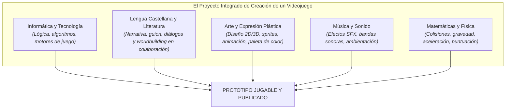
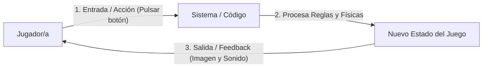
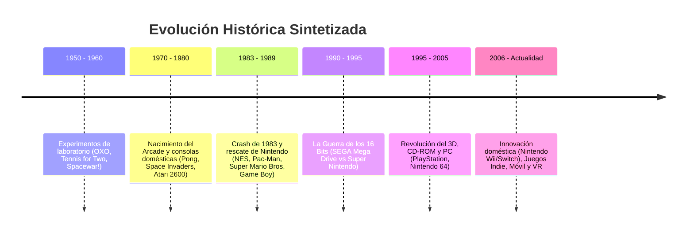
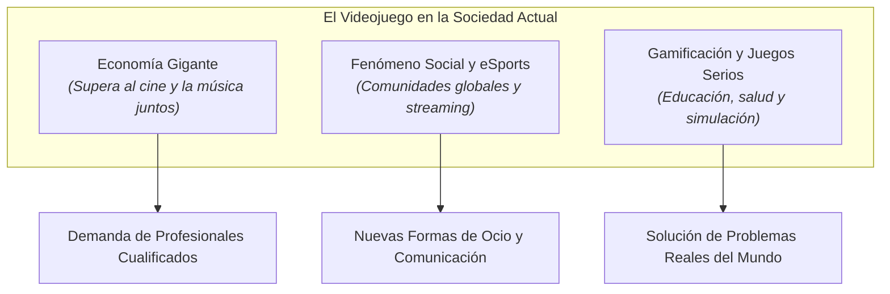
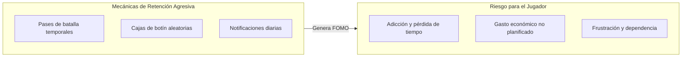
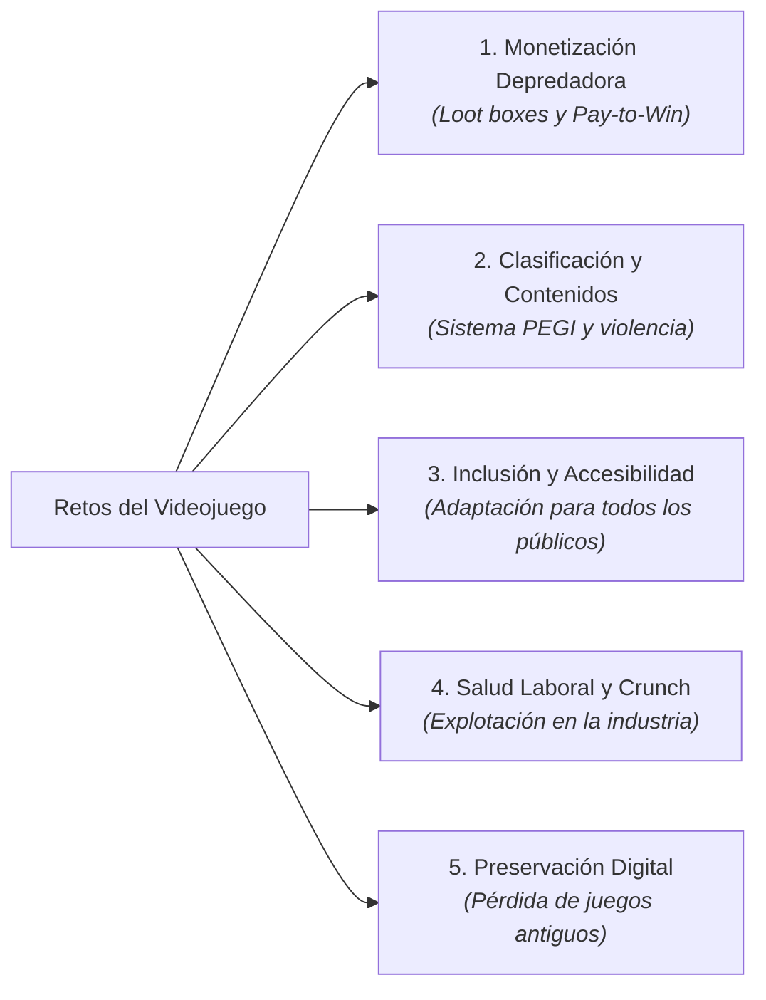

# Tema 0: Introducción al Taller de Videojuegos


*Figura 1: El desarrollo de videojuegos combina arte, narrativa, diseño de sonido y programación en un proyecto creativo único.*

---

## Tabla de Contenidos

<details open>
<summary><b>Índice del tema (haz clic para desplegar o navegar)</b></summary>

- [Tema 0: Introducción al Taller de Videojuegos](#tema-0-introducción-al-taller-de-videojuegos)
  - [Tabla de Contenidos](#tabla-de-contenidos)
  - [1. ¡Bienvenidos al Taller de Videojuegos!](#1-bienvenidos-al-taller-de-videojuegos)
    - [¿De qué trata esta asignatura?](#de-qué-trata-esta-asignatura)
    - [¿Qué es (realmente) un videojuego?](#qué-es-realmente-un-videojuego)
      - [La diferencia clave: La Interactividad y el Bucle de Juego](#la-diferencia-clave-la-interactividad-y-el-bucle-de-juego)
    - [Los 4 Pilares de un Videojuego (El Modelo MDA)](#los-4-pilares-de-un-videojuego-el-modelo-mda)
  - [2. Resumen de la Historia y Evolución de los Videojuegos](#2-resumen-de-la-historia-y-evolución-de-los-videojuegos)
  - [3. La Influencia e Impacto de los Videojuegos en la Sociedad](#3-la-influencia-e-impacto-de-los-videojuegos-en-la-sociedad)
    - [A. Un Gigante Económico y Cultural](#a-un-gigante-económico-y-cultural)
    - [B. Mecánicas de Retención y Economía de la Atención](#b-mecánicas-de-retención-y-economía-de-la-atención)
    - [C. Gamificación: Los Juegos en el Mundo Real](#c-gamificación-los-juegos-en-el-mundo-real)
    - [D. Salidas Profesionales y Futuro Laboral](#d-salidas-profesionales-y-futuro-laboral)
  - [4. Pasar de Jugadores Pasivos a Creadores Activos](#4-pasar-de-jugadores-pasivos-a-creadores-activos)
    - [¿Por qué esta competencia es fundamental para tu futuro real?](#por-qué-esta-competencia-es-fundamental-para-tu-futuro-real)
  - [5. Los Grandes Retos de la Industria del Videojuego](#5-los-grandes-retos-de-la-industria-del-videojuego)
  - [6. ¿Dónde Estamos y Hacia Dónde Nos Dirigimos? El Contexto Tecnológico Actual](#6-dónde-estamos-y-hacia-dónde-nos-dirigimos-el-contexto-tecnológico-actual)
    - [Tendencias y Vectores del Cambio Actual](#tendencias-y-vectores-del-cambio-actual)
  - [7. Ejercicios y Actividades de Consolidación Globales](#7-ejercicios-y-actividades-de-consolidación-globales)
    - [1. Definición y conceptos básicos (Respuesta corta)](#1-definición-y-conceptos-básicos-respuesta-corta)
    - [2. Relaciona las columnas (Conceptos e Historia del Videojuego)](#2-relaciona-las-columnas-conceptos-e-historia-del-videojuego)
    - [3. Completa los huecos (Pilares y Mecánicas)](#3-completa-los-huecos-pilares-y-mecánicas)
    - [4. Cuadro comparativo: Jugador Pasivo vs. Diseñador/Creador Activo](#4-cuadro-comparativo-jugador-pasivo-vs-diseñadorcreador-activo)
    - [5. Análisis de diagrama y lógica del juego](#5-análisis-de-diagrama-y-lógica-del-juego)
    - [6. Clasificación de Retos de la Industria](#6-clasificación-de-retos-de-la-industria)
    - [7. Cuestión de opinión fundamentada (¿Son los videojuegos arte?)](#7-cuestión-de-opinión-fundamentada-son-los-videojuegos-arte)
    - [8. Análisis ético de mecánicas de monetización](#8-análisis-ético-de-mecánicas-de-monetización)
    - [9. Mi Perfil de Creador/a Gamer](#9-mi-perfil-de-creadora-gamer)
    - [10. Balance Global: La Balanza del Videojuego](#10-balance-global-la-balanza-del-videojuego)
    - [Actividad de Investigación e Indagación Inicial](#actividad-de-investigación-e-indagación-inicial)

</details>

---

## 1. ¡Bienvenidos al Taller de Videojuegos!

¡Hola y bienvenidos a la asignatura **Taller de Videojuegos** para 4º de ESO!

Si estás leyendo esto, es muy probable que en algún momento de tu vida hayas disfrutado jugando con una consola, un ordenador o tu propio teléfono móvil. Los videojuegos forman parte de nuestras vidas cotidianas, de nuestro ocio y de la cultura popular contemporánea. Sin embargo, en esta asignatura no nos limitaremos a ser **jugadores (consumidores)**: vamos a dar el salto al otro lado de la pantalla para convertirnos en **creadores, diseñadores y desarrolladores**.

### ¿De qué trata esta asignatura?
En **Taller de Videojuegos** aprenderás a concebir, diseñar, construir y publicar tu propio videojuego jugable desde cero. Crear un videojuego es un reto multidisciplinar único; no consiste solo en escribir líneas de código informático, sino en combinar armoniosamente diferentes disciplinas del saber humano:



* **Informática y Tecnología:** Lógica de programación, estructuras de datos, gestión de eventos y uso de motores de juego (*Game Engines*).
* **Lengua Castellana y Literatura (Narrativa y Guion):** En colaboración directa con la asignatura de Castellano, trabajaremos la creación de mundos (*worldbuilding*), el desarrollo de personajes, la estructura del arco narrativo y el diseño de diálogos e historias interactivas.
* **Arte y Expresión Plástica:** Diseño de personajes, escenarios, animación 2D (*sprites*), modelado 3D e interfaces visuales.
* **Música y Sonido:** Composición de música de ambiente, efectos sonoros (*SFX*) y diseño auditivo emocional.
* **Matemáticas y Física:** Cálculo de coordenadas, sistemas de puntuación, detección de colisiones y simulación de movimiento (gravedad, saltos, rebotes).

---

### ¿Qué es (realmente) un videojuego?

Aunque todos reconocemos un videojuego al instante, definirlo formalmente nos ayuda a entender los engranajes que funcionan bajo la superficie:

> **Definición Formal:**  
> Un **videojuego** es un sistema digital e interactivo de entretenimiento en el que uno o varios jugadores toman decisiones a través de un dispositivo de entrada (mando, teclado, ratón, pantalla táctil, sensor) para modificar el estado de un mundo virtual que responde en tiempo real con retroalimentación visual, auditiva y/o háptica, siguiendo un conjunto de reglas previamente diseñadas.

#### La diferencia clave: La Interactividad y el Bucle de Juego
A diferencia del cine, la televisión o la lectura de un libro —donde el espectador es un observador pasivo—, en el videojuego **el jugador es el protagonista activo**. Sin las decisiones y acciones del jugador, la experiencia se detiene por completo.



---

### Los 4 Pilares de un Videojuego (El Modelo MDA)

En la industria profesional del videojuego se utiliza la metodología **MDA** (*Mechanics, Dynamics, Aesthetics*) complementada con la tecnología para estructurar cualquier obra:

| Pilar | Descripción | Ejemplo Práctico |
| :--- | :--- | :--- |
| **Mecánicas (Mechanics)** | Las reglas básicas, acciones y algoritmos que definen qué se puede hacer. | Saltar, disparar, recoger monedas, abrir inventario, tiempo límite. |
| **Estética y Arte (Aesthetics)** | La respuesta emocional y visual que transmite el juego (gráficos, sonido, interfaz). | Estilo *Pixel Art* retro, música de misterio, gráficos 3D realistas. |
| **Narrativa (Narrative)** | El guion, los personajes, el universo y el motivo por el que se lucha. | Un robot explorador debe salvar su planeta antes de que se agote la batería. |
| **Tecnología (Technology)** | El motor de juego, la plataforma hardware y el código que sostiene todo. | Godot Engine, Unity, Scratch, PC, Consola Nintendo Switch, Pantalla táctil. |


*Figura 2: La consola Nintendo Switch y sus mandos representan la evolución de la interacción directa entre los jugadores y el mundo digital.*

> **Actividades del apartado:**
> 1. **Análisis de un clásico:** Elige un videojuego clásico como *Tetris* o *Pac-Man* e identifica sus 4 pilares (Mecánicas, Arte, Narrativa y Tecnología).
> 2. **El poder de la interactividad:** Piensa en tu película favorita. ¿Cómo cambiaría la historia si fuera un videojuego interactivo en el que tú tomas las decisiones?
> 3. **Mapeo multidisciplinar:** ¿Qué parte del desarrollo de un videojuego crees que se te dará mejor (programación, dibujo, guion o música) y por qué?

---

## 2. Resumen de la Historia y Evolución de los Videojuegos

Para diseñar los juegos del futuro es imprescindible conocer el camino recorrido. La historia del videojuego es una aventura apasionante de creatividad, giros tecnológicos y superación que abarca más de siete décadas de innovación:




*Figura 3: La evolución desde los salones arcade de los 70 hasta las consolas híbridas actuales marca el rumbo de la industria.*

> **Actividad del apartado: Cronograma del Hardware Icónico**  
> Realiza una línea del tiempo o cronograma en tu libreta o documento digital centrado en la aparición del **hardware más emblemático** de la industria (máquinas Arcade, sistemas de emulación como MAME, Atari 2600, NES, Super Nintendo / SNES, SEGA Mega Drive, Game Boy, Sony PlayStation / PS1, Nintendo 64, Nintendo Switch...).  
> Para cada sistema o hardware icónico debes detallar:
> 1. **Compañía creadora y época de lanzamiento.**
> 2. **Novedad o innovación tecnológica clave que introdujo** (por ejemplo: monederos e interacción pública en Arcades, cartuchos magnéticos intercambiables, salto a los 16 bits, almacenamiento masivo en CD-ROM, stick analógico para entornos 3D, preservación histórica mediante MAME, concepto híbrido sobremesa/portátil...).
> 3. **Un juego icono** que demostrara el potencial de ese hardware.

> **Estudio a fondo:**  
> En el [Tema 1: Historia y Evolución de los Videojuegos](../Tema%201%20-%20Historia%20dels%20videojocs/historia_cas.md) analizaremos en profundidad cada una de estas fases históricas, sus autores clave (como Shigeru Miyamoto o Ralph Baer), la crisis del Crash de 1983 y la evolución del hardware.

---

## 3. La Influencia e Impacto de los Videojuegos en la Sociedad

Los videojuegos han dejado de ser un simple pasatiempo infantil para convertirse en el **medio de comunicación y entretenimiento más influyente del siglo XXI**.



### A. Un Gigante Económico y Cultural
La industria del videojuego factura al año **más ingresos económicos que las industrias del cine y de la música combinadas**. España y la Comunitat Valenciana albergan decenas de estudios independientes (*indies*) y empresas tecnológicas que generan empleo de alta cualificación.

### B. Mecánicas de Retención y Economía de la Atención
Muchos videojuegos modernos (especialmente los juegos móviles y *Free-to-Play*) están diseñados minuciosamente para captar nuestra atención durante horas mediante psicología conductual:
- **Eventos diarios y pases de batalla:** Crean el efecto *FOMO* (*Fear Of Missing Out* o miedo a perderse algo) para obligar a conectarse cada día.
- **Microtransacciones y Loot Boxes (Cajas de Botín):** Diseños comerciales que invitan a gastar dinero real dentro del juego para conseguir aspectos estéticos o ventajas competitivas.
- **Sistemas de recompensa variable:** Mecánicas similares a las de los juegos de azar que liberan dopamina en el cerebro al recibir premios aleatorios.

Entender estas mecánicas nos permite jugar con **autonomía, autocontrol y sentido crítico**, evitando caer en hábitos de consumo poco saludables.



### C. Gamificación: Los Juegos en el Mundo Real
La **gamificación** consiste en aplicar dinámicas, reglas y elementos propios de los videojuegos en entornos no lúdicos para motivar y resolver problemas reales:
- **Educación:** Placas de aprendizaje, simuladores (*Minecraft Education*, *Kahoot!*).
- **Medicina:** Videojuegos terapéuticos para rehabilitación motora o estimulación cognitiva.
- **Entrenamiento Profesional:** Simuladores de vuelo para pilotos y simuladores quirúrgicos para médicos.

### D. Salidas Profesionales y Futuro Laboral
El desarrollo de videojuegos abre las puertas a profesiones emergentes de gran proyección:
1. **Programador/a de Videojuegos:** Escribe la lógica, físicas y sistemas del juego.
2. **Game Designer (Diseñador/a de Juego):** Diseña las reglas, el equilibrio (*balancing*) y la experiencia del jugador.
3. **Guionista / Narrative Designer:** Escribe la historia, diálogos y misiones (apoyándose en competencias lingüísticas).
4. **Artista 2D/3D y Animador/a:** Crea los personajes, entornos y efectos visuales.
5. **Diseñador/a de Sonido y Compositor/a:** Diseña el apartado auditivo y la música.
6. **Tester / QA (Quality Assurance):** Detecta fallos informáticos (*bugs*) y evalúa la jugabilidad.

> **Actividades del apartado:**
> 1. **Análisis de retención:** Identifica una mecánica en un juego que juegues habitualmente (por ejemplo, *Fortnite*, *Brawl Stars* o *Clash Royale*) diseñada para que te conectes todos los días.
> 2. **Diseña una app gamificada:** Piensa cómo gamificarías una tarea cotidiana que te resulte aburrida (como recoger tu habitación o estudiar vocabulario) usando puntos, niveles o recompensas.
> 3. **Perfiles de la industria:** Si tuvieras que fundar tu propio estudio de desarrollo con 3 compañeros/as de clase, ¿qué rol asumiría cada uno?

---

## 4. Pasar de Jugadores Pasivos a Creadores Activos

Saber jugar muy bien a un juego o tener nivel alto en un eSport no te convierte automáticamente en diseñador de videojuegos. Existe un salto fundamental entre ser un **jugador pasivo** y convertirse en un **creador activo y crítico**.

| Perfil | Actitud habitual | Relación con el videojuego |
| :--- | :--- | :--- |
| **Jugador Pasivo** | Juega sin preguntarse cómo funciona, consume contenidos de forma ilimitada, se frustra si pierde y gasta dinero impulsivamente. | Es consumido y controlado por el diseño del juego. |
| **Creador / Diseñador Activo** | Analiza las mecánicas, comprende por qué un nivel es divertido, busca fallos (*bugs*), programa sus ideas y respeta las reglas de diseño. | Utiliza el videojuego como medio de expresión artística y técnica. |


*Figura 4: Aprender a colaborar en equipo para diseñar niveles, crear historias y programar cambia nuestra perspectiva del mundo digital.*

### ¿Por qué esta competencia es fundamental para tu futuro real?

1. **Pensamiento Computacional y Lógico:** Aprenderás a desglosar una idea compleja (ej: "un enemigo me persigue y dispara") en instrucciones elementales que un ordenador puede procesar paso a paso.
2. **Creatividad y Expresión Narrativa:** A través de la colaboración con la asignatura de Castellano, serás capaz de estructurar historias interactivas donde las decisiones del jugador modifican el rumbo del relato.
3. **Gestión de Proyectos y Trabajo Colaborativo:** Un videojuego no se hace en solitario. Trabajarás en equipo planificando fases, repartiendo roles y cumpliendo plazos reales.
4. **Análisis Crítico de Mecánicas:** Pasarás de decir *"este juego me gusta"* a razonar *"este juego funciona porque su curva de dificultad está bien ajustada y la recompensa es justa"*.

> **Actividades del apartado:**
> 1. **Autoevaluación:** ¿Te consideras actualmente un jugador puramente consumidor o un creador curioso? ¿Qué te gustaría cambiar este curso?
> 2. **El 'Bug' como oportunidad:** Recuerda algún fallo o *bug* gracioso que hayas visto en un juego. ¿Qué parte del código crees que falló para que eso ocurriera?
> 3. **Desglose de acciones:** Escribe paso a paso (como un algoritmo) todas las instrucciones necesarias para que un personaje salte sobre una plataforma cuando presiona la barra espaciadora.

---

## 5. Los Grandes Retos de la Industria del Videojuego

Al igual que ocurre en el mundo digital general, el universo de los videojuegos afronta dilemas éticos, sociales y técnicos que debemos comprender como creadores conscientes:




*Figura 5: La preservación del videojuego clásico y la responsabilidad en el diseño son retos fundamentales para la cultura digital.*

- **Monetización Depredadora (*Pay-to-Win* y Cajas de Botín):** El dilema ético entre diseñar para divertir o diseñar para exprimir económicamente al usuario mediante apuestas encubiertas.
- **Clasificación por Edades (Código PEGI / ESRB):** La responsabilidad de etiquetar correctamente el contenido (violencia, lenguaje soez, compras integradas) para proteger a los menores.
- **Inclusión, Diversidad y Accesibilidad:** Crear juegos accesibles para personas con diversidad funcional motora, visual o auditiva (controles reasignables, paletas para daltonismo, subtítulos para sordos) y representar la diversidad social con respeto.
- **Condiciones Laborales (*Crunch*):** La problemática de las jornadas de trabajo excesivas no pagadas en los grandes estudios antes de los lanzamientos.
- **Preservación del Videojuego y Propiedad Digital:** Cuando un juego es exclusivamente online o requiere servidores que la empresa apaga, el juego desaparece para siempre. ¿Cómo protegemos la historia digital?

> **Actividades del apartado:**
> 1. **Investiga el código PEGI:** Busca qué significan las etiquetas PEGI 3, PEGI 7, PEGI 12, PEGI 16 y PEGI 18 y cuáles son los descriptores de contenido.
> 2. **Diseño accesible:** Piensa en un juego donde el jugador sea daltónico. ¿Qué cambios harías en la paleta de colores o formas para que pudiera jugar sin problemas?
> 3. **Debate sobre preservación:** Si compraste un videojuego en versión digital y la empresa cierra su servidor 5 años después impidiéndote jugar, ¿te parece justo? Argumenta tu postura.

---

## 6. ¿Dónde Estamos y Hacia Dónde Nos Dirigimos? El Contexto Tecnológico Actual

El desarrollo de videojuegos evoluciona a un ritmo vertiginoso impulsado por la innovación técnica:


*Figura 6: La Realidad Virtual (VR), el Cloud Gaming y la Inteligencia Artificial están redefiniendo las fronteras de la inmersión.*

### Tendencias y Vectores del Cambio Actual

1. **Inteligencia Artificial en el Desarrollo:** Herramientas de IA que ayudan a generar código, redactar diálogos secundarios, crear texturas, componer música o simular comportamientos de NPCs (*Non-Playable Characters*) mucho más inteligentes y realistas.
2. **Democratización con Motores 'Open Source' y Accesibles:** Motores como **Godot Engine** (gratuito y de código abierto) o herramientas visuales como Construct y Scratch permiten a estudios de 1 persona o estudiantes de ESO crear juegos profesionales sin presupuestos millonarios.
3. **El Auge de la Escena 'Indie' (Independiente):** Juegos con presupuestos pequeños pero con ideas geniales (*Minecraft*, *Hollow Knight*, *Celeste*, *Undertale*, *Balatro*) superan a menudo en éxito a producciones de cientos de millones de dólares.
4. **Juego en la Nube (*Cloud Gaming*) y Realidad Virtual (VR):** Servidores remotos que procesan el juego en streaming a cualquier pantalla (móvil, TV) y visores que introducen al jugador físicamente dentro del escenario.

> **Actividades del apartado:**
> 1. **Fenómeno Indie:** Busca información sobre el desarrollo de *Celeste* o *Hollow Knight*. ¿Cuántas personas formaban el equipo de desarrollo?
> 2. **IA en los juegos:** ¿En qué aspectos crees que la Inteligencia Artificial puede mejorar un videojuego y en cuáles crees que el toque humano sigue siendo insustituible?
> 3. **El motor del curso:** Investigad sobre el motor **Godot Engine** y por qué es una de las herramientas más recomendadas para la educación y el desarrollo independiente.

---

## 7. Ejercicios y Actividades de Consolidación Globales

A continuación se presentan 10 actividades variadas para repasar, reflexionar y consolidar de manera individual todos los conceptos clave trabajados en este tema de introducción:

### 1. Definición y conceptos básicos (Respuesta corta)
Explica con tus propias palabras qué es un **videojuego** y detalla por qué la **interactividad** lo diferencia de otros medios de entretenimiento como el cine o la literatura.

### 2. Relaciona las columnas (Conceptos e Historia del Videojuego)
Asocia cada hito o concepto de la **Columna A** con su correspondiente definición o repercusión en la **Columna B**:

| Columna A | Columna B |
| :--- | :--- |
| **1.** Modelo MDA | **A.** Primera consola doméstica que usaba cartuchos intercambiables. |
| **2.** Crash de 1983 | **B.** Metodología basada en Mecánicas, Estética y Narrativa. |
| **3.** Atari 2600 | **C.** Quiebra masiva de la industria por falta de control de calidad. |
| **4.** Godot Engine | **D.** Plataforma digital clave para la distribución de juegos indie. |
| **5.** Steam / itch.io | **E.** Motor de juegos gratuito y de código abierto accesible para educación. |

*Escribe tus respuestas emparejando el número con la letra (ejemplo: 1-B, 2-C...)*

---

### 3. Completa los huecos (Pilares y Mecánicas)
Rellena los espacios en blanco utilizando los siguientes términos: *Game Loop*, *Mecánicas*, *FOMO*, *GDD*, *Interactividad*.

> a) Las reglas y acciones que determinan lo que el jugador puede hacer dentro del juego se denominan _______________.
> 
> b) El documento técnico donde se especifica toda la visión, reglas y arte de un proyecto antes de programar se llama _______________.
> 
> c) El ciclo básico repetitivo de entrada, procesamiento y salida gráfica en tiempo real se conoce como _______________.
> 
> d) Las promociones por tiempo limitado en juegos móviles generan el efecto _______________ para evitar que el usuario deje de conectarse.

---

### 4. Cuadro comparativo: Jugador Pasivo vs. Diseñador/Creador Activo
Completa la siguiente tabla señalando qué actitud adoptaría cada perfil ante las situaciones planteadas:

| Situación planteada | Actitud del Jugador Pasivo | Actitud del Creador / Diseñador Activo |
| :--- | :--- | :--- |
| Se encuentra con un nivel extremadamente difícil | | |
| Ve un fallo visual o *bug* donde el personaje atraviesa una pared | | |
| Recibe un mensaje para comprar una caja de botín aleatoria | | |

---

### 5. Análisis de diagrama y lógica del juego
Observa el siguiente esquema simplificado del Bucle de Juego (*Game Loop*):

```
[Pulsar Tecla 'Flecha Derecha'] ---> [Sumar +5 a Posición_X del Personaje] ---> [Redibujar Sprite en Pantalla]
```

Explica qué ocurriría en la pantalla si el programador olvida incluir la parte de *Redibujar Sprite en Pantalla* aunque el código siga sumando +5 a la posición interna.

---

### 6. Clasificación de Retos de la Industria
Clasifica cada una de las siguientes situaciones según el **Reto de la Industria del Videojuego** al que corresponde (*Monetización Depredadora*, *Inclusión y Accesibilidad*, *Clasificación PEGI*, *Preservación Digital*, *Salud Laboral / Crunch*):

- **A.** Un juego que añade la opción de cambiar los botones para que una persona con movilidad reducida pueda jugar con una sola mano. → _______________
- **B.** Programadores trabajando 14 horas diarias durante 3 meses seguidos para terminar un juego a tiempo. → _______________
- **C.** Una tienda digital que cierra sus servidores impidiendo volver a descargar juegos antiguos pagados. → _______________
- **D.** Un aviso en la portada del juego indicando que contiene compras dentro de la aplicación y violencia moderada. → _______________
- **E.** Un cofre virtual que exige pagar 2€ reales por una probabilidad del 1% de conseguir una espada legendaria. → _______________

---

### 7. Cuestión de opinión fundamentada (¿Son los videojuegos arte?)
Redacta un texto argumentativo de entre 6 y 10 líneas respondiendo a la pregunta: *¿Consideras que los videojuegos deberían ser reconocidos oficialmente como la 8ª Arte, a la altura de la pintura, el cine o la música?* Apóyate en elementos como la narrativa, la música y la dirección artística para fundamentar tu postura.

---

### 8. Análisis ético de mecánicas de monetización
Imagina que estás diseñando un videojuego para móviles. Explica la diferencia entre un modelo de monetización **ético** (ej: vender aspectos estéticos opcionales sin ventaja) y un modelo **depredador** (ej: impedir avanzar en el juego si no pagas dinero real o esperar 24 horas).

---

### 9. Mi Perfil de Creador/a Gamer
Rellena la siguiente plantilla personal con tus datos reales:

- **Plataforma principal donde suelo jugar:** ____________________
- **Mi videojuego favorito de todos los tiempos:** ____________________
- **Área en la que me gustaría colaborar más en mi equipo (Programación / Arte / Guion / Sonido):** ____________________
- **Un hábito de juego responsable que me comprometo a mantener:** ____________________
- **Nombre de fantasía para nuestro futuro estudio de videojuegos de clase:** ____________________

---

### 10. Balance Global: La Balanza del Videojuego
Redacta una reflexión final (entre 5 y 10 líneas): En la balanza global de la sociedad, ¿crees que los videojuegos aportan más beneficios (educación, cultura, trabajo en equipo, entretenimiento) o más riesgos (adicción, sedentarismo, gastos impulsivos)? Justifica tu respuesta aportando **dos argumentos a favor** y **dos medidas de prevención**.

---

### Actividad de Investigación e Indagación Inicial

> **Proyectos de Indagación:**
> 
> 1. **La historia del desarrollo independiente (Indie)**: Investigad la historia de *Minecraft* o *Balatro*. ¿Cómo consiguieron creadores en solitario superar en ventas a superproducciones multimillonarias?
> 2. **Juegos con impacto social (Serious Games)**: Investigad sobre videojuegos creados específicamente para concienciar sobre el cambio climático, la salud mental o la historia (ejemplo: *Gris*, *Never Alone*, *Through the Darkest of Times*).
> 3. **Auditoría de tu videojuego favorito**: Selecciona un juego y averigua con qué motor (*Game Engine*) fue desarrollado (Unity, Unreal Engine, Godot, motor propio...) y de cuántas personas constaba el equipo de desarrollo.

