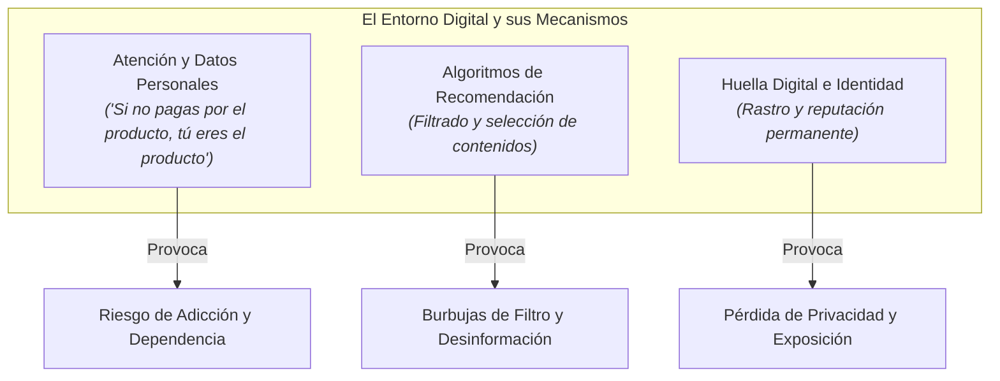
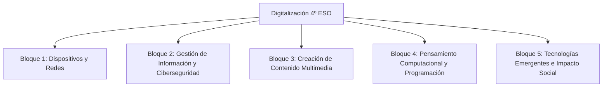
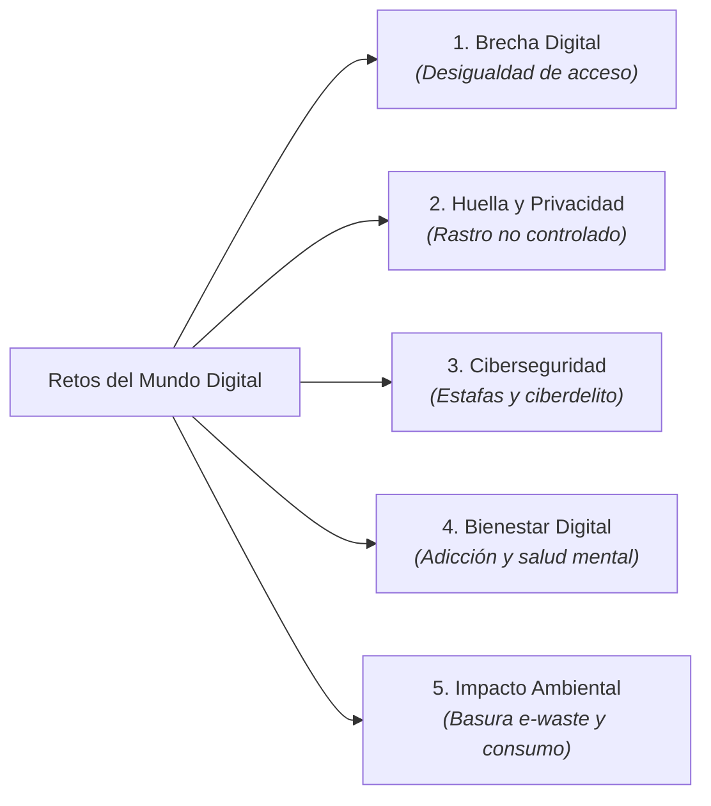
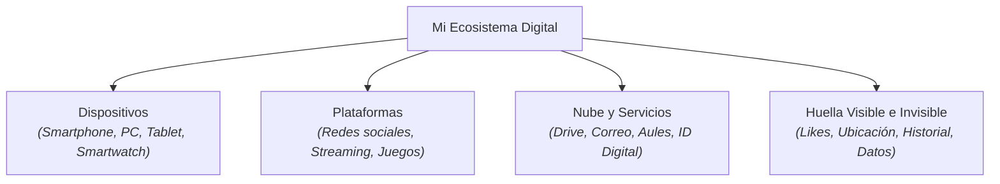

# Tema 0: Introducción a la Digitalización


*Figura 1: La red global de datos y la digitalización interconectan todos los ámbitos de la sociedad moderna.*

---

## Tabla de Contenidos

<details open>
<summary><b>Índice del tema (haz clic para desplegar o navegar)</b></summary>

- [Tema 0: Introducción a la Digitalización](#tema-0-introducción-a-la-digitalización)
  - [Tabla de Contenidos](#tabla-de-contenidos)
  - [1. ¿Qué es la Digitalización?](#1-qué-es-la-digitalización)
    - [Comparativa: Mapeo del Mundo Analógico al Digital](#comparativa-mapeo-del-mundo-analógico-al-digital)
    - [De lo Analógico a lo Digital: Un Salto Histórico](#de-lo-analógico-a-lo-digital-un-salto-histórico)
  - [2. La Necesidad de Ser Conscientes del Mundo Digital](#2-la-necesidad-de-ser-conscientes-del-mundo-digital)
    - [A. La Ilusión de la "Gratuidad" y la Economía de la Atención](#a-la-ilusión-de-la-gratuidad-y-la-economía-de-la-atención)
    - [B. Algoritmos y Filtrado de la Realidad](#b-algoritmos-y-filtrado-de-la-realidad)
    - [C. Autonomía e Identidad Digital](#c-autonomía-e-identidad-digital)
    - [D. Ciudadanía Crítica y Derechos Digitales](#d-ciudadanía-crítica-y-derechos-digitales)
  - [3. Pasar de Usuarios Pasivos a Ciudadanos Digitales Activos](#3-pasar-de-usuarios-pasivos-a-ciudadanos-digitales-activos)
    - [¿Por qué esta competencia es fundamental para tu futuro real?](#por-qué-esta-competencia-es-fundamental-para-tu-futuro-real)
  - [4. Visión Global de la Asignatura: ¿Qué vamos a aprender?](#4-visión-global-de-la-asignatura-qué-vamos-a-aprender)
    - [Tabla Resumen de los Contenidos del Curso](#tabla-resumen-de-los-contenidos-del-curso)
  - [5. Los Grandes Retos del Mundo Digital](#5-los-grandes-retos-del-mundo-digital)
  - [6. ¿Dónde Estamos y Hacia Dónde Nos Dirigimos? El Contexto Tecnológico Actual](#6-dónde-estamos-y-hacia-dónde-nos-dirigimos-el-contexto-tecnológico-actual)
    - [Tendencias y Vectores del Cambio Actual:](#tendencias-y-vectores-del-cambio-actual)
  - [7. La Huella Tecnológica Personal: Tu Ecosistema Digital](#7-la-huella-tecnológica-personal-tu-ecosistema-digital)
  - [8. Ejercicios y Actividades de Consolidacion Globales](#8-ejercicios-y-actividades-de-consolidacion-globales)
    - [1. Definición y conceptos básicos (Respuesta corta)](#1-definición-y-conceptos-básicos-respuesta-corta)
    - [2. Relaciona las columnas (Mundo Analógico vs. Mundo Digital)](#2-relaciona-las-columnas-mundo-analógico-vs-mundo-digital)
    - [3. Completa los huecos (Mecanismos del entorno digital)](#3-completa-los-huecos-mecanismos-del-entorno-digital)
    - [4. Cuadro comparativo: Consumidor Pasivo vs. Creador Digital Activo](#4-cuadro-comparativo-consumidor-pasivo-vs-creador-digital-activo)
    - [5. Análisis de imagen y dilema técnico](#5-análisis-de-imagen-y-dilema-técnico)
    - [6. Clasificación de Retos Digitales](#6-clasificación-de-retos-digitales)
    - [7. Cuestión de opinión fundamentada (Propiedad Digital)](#7-cuestión-de-opinión-fundamentada-propiedad-digital)
    - [8. Análisis de veracidad y verificación](#8-análisis-de-veracidad-y-verificación)
    - [9. Mi Ecosistema Digital](#9-mi-ecosistema-digital)
    - [10. Balance Global: La Balanza Digital](#10-balance-global-la-balanza-digital)
    - [Actividad de Investigación e Indagación Inicial](#actividad-de-investigación-e-indagación-inicial)

</details>

---

## 1. ¿Qué es la Digitalización?

Vivimos en un mundo rodeado de pantallas, sensores, datos e inteligencia artificial. Pero, ¿qué significa realmente la palabra **digitalización**?

La **digitalización** es el proceso de transformar información, procesos, objetos y actividades analógicas (físicas o tradicionales) en formato digital. En otras palabras, consiste en convertir la información del mundo real en un lenguaje numérico (código binario de **ceros y unos**: `0` y `1`) que los ordenadores y dispositivos electrónicos pueden procesar, almacenar, transmitir y comprender.

### Comparativa: Mapeo del Mundo Analógico al Digital

```mermaid
graph LR
    subgraph MUNDO_ANALÓGICO["Mundo Analógico (Físico y Continuo)"]
        A1[Foto en papel]
        A2[Libro o libreta]
        A3[Monedas y billetes]
        A4[Carta postal]
        A5[Disco de vinilo]
    end

    subgraph PROCESO["Proceso de Digitalización"]
        P["Muestreo y Codificación Binaria (0 y 1)"]
    end

    subgraph MUNDO_DIGITAL["Mundo Digital (Virtual y Discreto)"]
        D1[Archivo JPG / PNG]
        D2[Documento PDF / eBook]
        D3[Bizum / Tarjeta Virtual]
        D4[Correo electrónico / Chat]
        D5[Archivo MP3 / Streaming]
    end

    MUNDO_ANALÓGICO --> PROCESO --> MUNDO_DIGITAL
```



### De lo Analógico a lo Digital: Un Salto Histórico
- **Mundo Analógico**: La información es continua y física. Un vinilo grabado con ondas de sonido, una fotografía revelada en carrete o un expediente en papel guardado en un archivador.
- **Mundo Digital**: La información es discreta y virtual. Se representa mediante datos numéricos (`bits`). Esto permite copiarla infinitas veces sin pérdida de calidad, enviarla a la otra punta del planeta en milisegundos y almacenarla en espacios reducidos (servidores, la "nube" o memorias flash).

>  **Actividades del apartado:**
> 1. **Análisis de objetos:** Identifica tres objetos o hábitos analógicos de tus padres o abuelos y explica cómo se han transformado en sus equivalentes digitales actuales.
> 2. **Debate analógico vs. digital:** ¿Qué aspectos del mundo analógico (como leer un libro físico o escuchar un disco de vinilo) crees que se pierden al digitalizarse? ¿Vale la pena digitalizarlo absolutamente todo?
> 3. **El reto del código binario:** Explica con tus palabras por qué los ordenadores necesitan convertir las imágenes, vídeos y sonidos a ceros y unos (`0` y `1`) en lugar de procesarlos directamente como los vemos y oímos los humanos.

---

## 2. La Necesidad de Ser Conscientes del Mundo Digital

No vivimos simplemente en un mundo que *usa* tecnología; vivimos en una **sociedad completamente digitalizada**. La tecnología ya no es solo una herramienta puntual como lo era una calculadora o una máquina de escribir; es el **medio en el que suceden la economía, la información, las relaciones humanas, la política y el trabajo**.



Comprender y ser conscientes del entorno digital en el que estamos inmersos es indispensable por varias razones clave de nuestra vida real:

### A. La Ilusión de la "Gratuidad" y la Economía de la Atención
Cuando usamos redes sociales, buscadores o plataformas sin pagar dinero, solemos pensar que son gratuitas. La realidad es que **nosotros somos el producto**. Nuestra atención, nuestras búsquedas, nuestros gustos y nuestros datos personales son la moneda de cambio. Ser conscientes de esto nos permite decidir con libertad cómo y cuándo consumir tecnología, en lugar de dejar que algoritmos diseñados para captar nuestra atención decidan por nosotros.

### B. Algoritmos y Filtrado de la Realidad
Gran parte de las noticias que leemos, los vídeos que nos aparecen o las recomendaciones que recibimos están guiadas por **algoritmos de recomendación**. Si no somos conscientes de cómo funcionan:
- Podemos caer en **burbujas de filtro** y **cámaras de eco**, donde solo vemos opiniones con las que ya estamos de acuerdo.
- Nos volvemos vulnerables a la **desinformación** y a la manipulación en momentos clave (elecciones, crisis de salud, tendencias de consumo).

### C. Autonomía e Identidad Digital
Cada interacción deja una **huella digital** imborrable. Nuestra identidad ya no se limita a nuestra presencia física; existe una versión digital de nosotros construida por fotos, comentarios, ubicaciones y hábitos de compra. Ser consciente del mundo digital significa tomar las riendas de nuestra reputación y privacidad para evitar que condicionen nuestro futuro personal y profesional.

### D. Ciudadanía Crítica y Derechos Digitales
En el mundo real, ser un ciudadano informado requiere conocer tus derechos digitales: la protección de tus datos personales, la neutralidad de la red, la propiedad intelectual y el acceso equitativo a la tecnología. Un ciudadano desinformado digitalmente es más manipulable y dependiente.

>  **Actividades del apartado:**
> 1. **Descodificando la "gratuidad":** Piensa en la aplicación o red social que más utilizas. Si no pagas dinero por ella, ¿de qué formas crees que la empresa obtiene beneficios económicos a partir de tu actividad y tus datos?
> 2. **Tu burbuja de filtro:** Reflexiona sobre los vídeos o publicaciones que te sugiere tu red social favorita. ¿Crees que te muestran opiniones variadas o tienden a enseñarte siempre lo mismo? ¿Por qué ocurre esto?
> 3. **Tu huella imborrable:** ¿Alguna vez has buscado tu nombre o el de alguien conocido en Google? ¿Qué información aparece y qué imagen crees que transmite sobre esa persona?

---

## 3. Pasar de Usuarios Pasivos a Ciudadanos Digitales Activos

Saber deslizar la pantalla de un smartphone o publicar un vídeo no nos convierte en expertos en tecnología. En el mundo real existe una gran diferencia entre ser un **consumidor pasivo** y ser un **ciudadano digital proactivo, crítico y creador**.

| Perfil | Actitud habitual | Relación con la tecnología |
| :--- | :--- | :--- |
| **Consumidor Pasivo** | Consume contenidos infinitos, acepta términos sin leer, comparte datos alegremente, cree todo lo que ve. | Es controlado por la tecnología y los algoritmos. |
| **Ciudadano Digital Activo** | Crea contenidos, programa, protege sus datos, cuestiona las fuentes, comprende cómo funcionan las herramientas. | Utiliza la tecnología para resolver problemas y mejorar su entorno. |


*Figura 2: Trabajar en equipo para crear, programar y resolver problemas transforma nuestro papel de simples espectadores a creadores de tecnología.*

### ¿Por qué esta competencia es fundamental para tu futuro real?

1. **Comprensión del Entorno**: Entender qué ocurre "detrás de la pantalla" cuando enviamos un mensaje, buscamos en Google o interactuamos con una Inteligencia Artificial.
2. **Capacidad de Creación y Emprendimiento**: Quien domina la tecnología no solo la consume, sino que la utiliza para resolver problemas reales, crear arte, diseñar soluciones, automatizar tareas y emprender proyectos.
3. **Ciberseguridad y Protección Personal**: En el mundo real existen amenazas tangibles (estafas bancarias, robo de identidad, chantaje digital). Saber defenderse no es opcional, es una necesidad básica de autoprotección.
4. **Transformación del Mercado de Trabajo**: Casi cualquier profesión actual (desde la medicina o el diseño gráfico hasta la mecánica, el derecho o la agricultura) se apoya en sistemas digitales avanzados. Dominar la digitalización abre puertas reales en cualquier campo profesional.
5. **Responsabilidad Social y Ética**: Evaluar el impacto medioambiental de los datos, los sesgos sociales que puede reproducir la Inteligencia Artificial y defender una sociedad digital más justa e inclusiva.

>  **Actividades del apartado:**
> 1. **Autoevaluación digital:** Haz un diagnóstico personal: en un porcentaje estimado del 0% al 100%, ¿cuánto tiempo pasas consumiendo contenido pasivamente y cuánto creando contenido o aprendiendo algo nuevo?
> 2. **Consumidor vs. Creador:** Pon tres ejemplos de proyectos o tareas digitales en las que dejes de ser un simple espectador y te conviertas en un creador activo (por ejemplo, editar un vídeo, programar un juego o diseñar una web).
> 3. **Ciberseguridad activa:** Identifica dos errores habituales que cometen los usuarios pasivos en Internet (como usar la misma contraseña o confiar en redes Wi-Fi públicas sin protección) y propone una solución proactiva.

---

## 4. Visión Global de la Asignatura: ¿Qué vamos a aprender?

La asignatura de **Digitalización de 4º de ESO** (siguiendo el currículo de la Comunitat Valenciana) se articula en torno a cinco grandes bloques fundamentales:



### Tabla Resumen de los Contenidos del Curso

| Tema / Bloque | ¿Qué estudiaremos? | Ejemplos de Actividades Prácticas |
| :--- | :--- | :--- |
| **0. Introducción** | Conceptos básicos de la digitalización, impacto social y hoja de ruta de la asignatura. | Debates sobre el uso de la tecnología, análisis del entorno digital personal. |
| **1. Dispositivos, Sistemas y Redes** | Hardware, software, arquitecturas de ordenadores, sistemas operativos y configuración de redes locales e Internet. | Análisis de componentes internos, comandos de red, configuración de redes Wi-Fi. |
| **2. Gestión de la Información, Ciberseguridad y Ciudadanía** | Búsqueda avanzada de información, huella digital, ciberseguridad, criptografía y bienestar digital. | Auditoría de contraseñas, detección de phishing, configuración de privacidad. |
| **3. Creación de Contenidos Multimedia** | Diseño gráfico, edición de audio/vídeo, licencias de propiedad intelectual (Creative Commons) y desarrollo web. | Edición con GIMP/Inkscape/Audacity, creación de un sitio web accesible en HTML/CSS. |
| **4. Pensamiento Computacional y Programación** | Algoritmos, lógica de programación, lenguajes (bloques/Python), desarrollo de aplicaciones o robótica. | Creación de pequeños programas, scripts de automatización, juegos o simulaciones. |
| **5. Tecnologías Emergentes e Impacto Socioeconómico** | Inteligencia Artificial (IA), Big Data, Internet de las Cosas (IoT), ética tecnológica y sostenibilidad. | Generación de prompts en IA, proyectos de domótica/IoT, análisis de sesgos en algoritmos. |

>  **Actividades del apartado:**
> 1. **Mis metas para el curso:** Revisa los 5 bloques del curso y elige los dos que más te llamen la atención. Explica brevemente qué te gustaría aprender a hacer en ellos.
> 2. **Conexión laboral:** Elige una profesión que te interese para el futuro (médico/a, arquitecto/a, diseñador/a, mecánico/a, docente...) y explica cómo se relaciona la digitalización con ese trabajo.
> 3. **Proyecto integrado:** En parejas, pensad en una idea de proyecto digital para vuestro centro escolar (por ejemplo, una app de biblioteca o un canal de radio escolar) e identificad qué bloques de la asignatura necesitaríais dominar.

---

## 5. Los Grandes Retos del Mundo Digital

La digitalización no solo aporta ventajas; también plantea grandes desafíos que debemos aprender a gestionar de forma consciente y ética:




*Figura 3: La acumulación de residuos electrónicos (e-waste) y el consumo energético masivo de los centros de datos representan un grave reto medioambiental.*

- **La Brecha Digital**: La desigualdad entre quienes tienen acceso rápido a la tecnología y la formación adecuada, y quienes carecen de ello por motivos económicos, geográficos o generacionales.
- **La Huella Digital y la Privacidad**: Cada clic, búsqueda o *like* deja un rastro de datos personales en la red que muchas empresas utilizan para crear perfiles comerciales o predecir conductas.
- **La Ciberseguridad**: Virus, *ransomware*, suplantación de identidad y ciberacoso (*cyberbullying*) requieren conocimientos de prevención activa.
- **La Adicción y el Bienestar Digital**: Aprender a gestionar el tiempo de pantalla y desconectar (*desintoxicación digital*) es fundamental para mantener la salud física y mental.
- **Impacto Ambiental de la Tecnología**: La fabricación de microchips, el consumo energético masivo de los centros de datos (servidores e IA) y la basura electrónica (*e-waste*) generan una huella ecológica considerable.

>  **Actividades del apartado:**
> 1. **La brecha en tu entorno:** ¿Conoces a alguien cercano (personas mayores, vecinos o familias) que tenga dificultades para realizar trámites digitales básicos? ¿Qué soluciones propondrías para reducir esa brecha?
> 2. **Basura electrónica (*e-waste*):** Investiga qué ocurre con los móviles viejos o los componentes electrónicos que se tiran a la basura doméstica. ¿Por qué es crucial reciclarlos en puntos limpios?
> 3. **El reto del bienestar digital:** ¿Serías capaz de pasar 24 horas consecutivas sin mirar ninguna pantalla (móvil, televisión, consola, PC)? ¿Qué dificultades crees que experimentarías?

---

## 6. ¿Dónde Estamos y Hacia Dónde Nos Dirigimos? El Contexto Tecnológico Actual

Estamos viviendo una de las transformaciones más rápidas e intensas de la historia de la humanidad. El panorama digital actual no es estático; evoluciona a un ritmo vertiginoso abriendo interrogantes fascinantes sobre cómo será nuestro futuro cercano.


*Figura 4: La eclosión de la Inteligencia Artificial y la automatización redefinirán el trabajo, la creatividad y el aprendizaje.*

### Tendencias y Vectores del Cambio Actual:

1. **La Era de la Inteligencia Artificial Generativa**: Hemos pasado de ordenadores que ejecutan órdenes preprogramadas a sistemas capaces de generar texto, imágenes, código o música, razonar y tomar decisiones. ¿Cómo cambiará esto el trabajo, el arte y el aprendizaje?
2. **El Cambio de Paradigma: Del Tener al Acceder (Pérdida de Posesión)**: Antes comprábamos CDs, películas en DVD, juegos físicos o licencias de software de por vida. Hoy pagamos suscripciones mensuales para acceder a música, cine, videojuegos y herramientas digitales en la nube. Ya no somos "dueños" de los bienes digitales, sino inquilinos temporales.
3. **Hiperconectividad e Internet de las Cosas (IoT)**: Todo a nuestro alrededor (relojes, electrodomésticos, coches, ciudades) está comenzando a recopilar datos y comunicarse entre sí en tiempo real.
4. **Automatización y Transformación del Trabajo**: Tareas mecánicas e intelectuales repetitivas están siendo automatizadas, lo que exige desarrollar habilidades humanas clave como la creatividad, el pensamiento crítico y la capacidad de resolver problemas no estructurados.

>  **Actividades del apartado:**
> 1. **El dilema de la propiedad digital:** Si pagas todos los meses por ver una serie o jugar en la nube y un día retiran ese contenido, ¿crees que habías "comprado" algo? ¿Qué diferencias le ves respecto a tener un disco o libro físico?
> 2. **Uso ético de la IA:** Si le pides a una Inteligencia Artificial que te haga un trabajo escolar y lo entregas sin modificarlo ni revisarlo, ¿qué dilemas éticos y problemas de aprendizaje crees que se plantean?
> 3. **El empleo del futuro:** Piensa en dos profesiones que crees que cambiarán radicalmente debido a la automatización y propone dos habilidades humanas que ninguna máquina podrá reemplazar fácilmente.

---

## 7. La Huella Tecnológica Personal: Tu Ecosistema Digital

Antes de sumergirnos en los bloques técnicos, es imprescindible mapear nuestro propio entorno. Cada uno de nosotros vive dentro de una "burbuja digital" formada por los dispositivos que usa, las plataformas que frecuenta, los datos que comparte de manera consciente o inconsciente y el tiempo que dedica a cada pantalla.



Analizar objetivamente cómo nos relacionamos con la tecnología nos permite tomar el control de nuestras herramientas en lugar de dejar que nos condicionen.

>  **Actividades del apartado:**
> 1. **Inventario de dispositivos:** Haz una lista de todos los aparatos con conexión a Internet que hay en tu hogar. ¿Cuántos usas tú diariamente y cuántas horas calculas que pasas frente a ellos?
> 2. **Auditoría de permisos:** Revisa los permisos (cámara, micrófono, ubicación, contactos) de las 3 aplicaciones que más utilizas en tu teléfono. ¿Todas necesitan realmente todos esos permisos para funcionar correctamente?
> 3. **Estimación de datos:** Si tuvieras que calcular cuántos datos personales tuyos (fotos, ubicaciones, búsquedas, hábitos) tienen guardados empresas de tecnología en la nube, ¿qué datos crees que serían los más sensibles o privados?

---

## 8. Ejercicios y Actividades de Consolidacion Globales

A continuación se presentan 10 actividades variadas para repasar, reflexionar y consolidar de manera individual todos los conceptos clave trabajados en este tema de introducción:

### 1. Definición y conceptos básicos (Respuesta corta)
Explica con tus propias palabras qué significa **digitalizar** una información o proceso y detalla qué función cumple el código binario (`0` y `1`) en los dispositivos informáticos.

### 2. Relaciona las columnas (Mundo Analógico vs. Mundo Digital)
Asocia cada elemento del **Mundo Analógico** (Columna A) con su correspondiente transformación en el **Mundo Digital** (Columna B):

| Columna A: Mundo Analógico | Columna B: Mundo Digital |
| :--- | :--- |
| **1.** Carta en papel enviada por correo postal | **A.** Plataforma de música en streaming (Spotify) |
| **2.** Colección de CDs de música | **B.** Mensaje instantáneo / Correo electrónico |
| **3.** Monedas y billetes en el monedero | **C.** Archivo PDF en la nube |
| **4.** Expediente médico en una carpeta física | **D.** Firma digital y certificado de identidad |
| **5.** Documento de identidad en tarjeta física | **E.** Bizum / Pago móvil sin contacto |

*Escribe tus respuestas emparejando el número con la letra (ejemplo: 1-B, 2-A...)*

---

### 3. Completa los huecos (Mecanismos del entorno digital)
Rellena los espacios en blanco utilizando los siguientes términos: *algoritmos de recomendación*, *atención*, *huella digital*, *burbuja de filtro*, *gratuito*.

> a) Cuando utilizamos un servicio web o aplicación que es totalmente _______________, debemos recordar la máxima: "Si no pagas por el producto, tú eres el producto", ya que la empresa comercializa con tus datos y tu _______________.
> 
> b) Cada búsqueda, me gusta, comentario o archivo subido a Internet contribuye a construir nuestra _______________ permanente en la red.
> 
> c) Las plataformas utilizan _______________ para analizar tus gustos y mostrarte contenidos personalizados, lo que puede encerrarte en una _______________ donde solo ves información acorde a tus preferencias.

---

### 4. Cuadro comparativo: Consumidor Pasivo vs. Creador Digital Activo
Completa la siguiente tabla señalando qué actitud adoptaría cada perfil ante las situaciones planteadas:

| Situación planteada | Actitud del Consumidor Pasivo | Actitud del Creador Digital Activo |
| :--- | :--- | :--- |
| Recibe un mensaje llamativo sobre un sorteo en WhatsApp | | |
| Quiere mostrar un proyecto o trabajo de clase | | |
| Insta una nueva aplicación en su teléfono | | |

---

### 5. Análisis de imagen y dilema técnico
Observa el siguiente gráfico sobre el proceso de digitalización:

```
[Señal Analógica (Onda Continua)] ---> [Muestreo y Codificación Binaria] ---> [Datos Digitales (0 y 1)]
```

¿Por qué crees que un archivo digital se puede copiar un millón de veces sin perder nada de calidad, mientras que una cinta de vídeo VHS o un cassette analógico se deterioraba cada vez que se copiaba o reproducía?

---

### 6. Clasificación de Retos Digitales
De la siguiente lista de situaciones reales, clasifica cada una según el **Reto del Mundo Digital** al que corresponde (*Brecha Digital*, *Ciberseguridad*, *Bienestar Digital*, *Impacto Ambiental*, *Privacidad*):

- **A.** Un abuelo no puede pedir cita médica porque la consulta solo se gestiona mediante una app móvil. → _______________
- **B.** Una persona recibe un correo falso que imita a su banco pidiendo sus claves de acceso. → _______________
- **C.** Sentir ansiedad o necesidad de revisar el teléfono móvil a los pocos minutos de dejarlo en la mesa. → _______________
- **D.** El enorme consumo de energía y agua que requieren los centros de datos que entrenan la Inteligencia Artificial. → _______________
- **E.** Un motor de búsqueda que guarda tu ubicación para enviarte publicidad de tiendas cercanas. → _______________

---

### 7. Cuestión de opinión fundamentada (Propiedad Digital)
Si pagas una suscripción mensual en una plataforma de videojuegos o series y la compañía decide eliminar un título de su catálogo, ¿sientes que te han quitado algo tuyo? Justifica tu respuesta reflexionando sobre las diferencias entre **poseer un objeto físico** y **alquilar acceso a la nube**.

---

### 8. Análisis de veracidad y verificación
Imagina que te llega un vídeo hiperrealista generado por Inteligencia Artificial (*deepfake*) en el que una persona famosa dice algo escandaloso. Enumera **tres pasos concretos** que darías como ciudadano digital crítico para verificar si el vídeo es verdadero o falso antes de compartirlo.

---

### 9. Mi Ecosistema Digital
Rellena la siguiente plantilla con tus propios datos reales:

- **Dispositivo principal que más utilizo:** ____________________
- **Tiempo medio diario de pantalla:** ____________________
- **Mi aplicación más usada:** ____________________
- **Medida de seguridad que ya aplico:** ____________________
- **Aspecto digital que me comprometo a mejorar este curso:** ____________________

---

### 10. Balance Global: La Balanza Digital
Redacta un texto breve (entre 5 y 10 líneas) respondiendo a esta cuestión: En una balanza global, ¿consideras que la digitalización aporta más beneficios o más inconvenientes a la sociedad actual? Menciona al menos **dos puntos positivos** y **dos puntos negativos** para argumentar tu postura.

---

### Actividad de Investigación e Indagación Inicial

> **Proyectos de Indagación:**
> 
> 1. **El fin de la propiedad privada digital**: Investigad qué ocurre si una plataforma de contenido en *streaming* (música, juegos o vídeo) decide retirar una obra de su catálogo o cerrar vuestra cuenta. ¿Somos realmente dueños de lo que compramos digitalmente?
> 2. **La paradoja de la Inteligencia Artificial**: Investigad cómo la IA puede ayudarnos a resolver problemas complejos (como descubrir medicamentos) pero, al mismo tiempo, genera retos como la desinformación masiva o el consumo masivo de agua y electricidad en sus servidores.
> 3. **Auditoría de tu Ecosistema Digital**: Elabora una lista de todos los dispositivos, aplicaciones y servicios en la nube que utilizas en una semana. ¿De cuántas empresas diferentes dependen? ¿Qué pasaría con tus datos si una de esas empresas cerrase mañana?