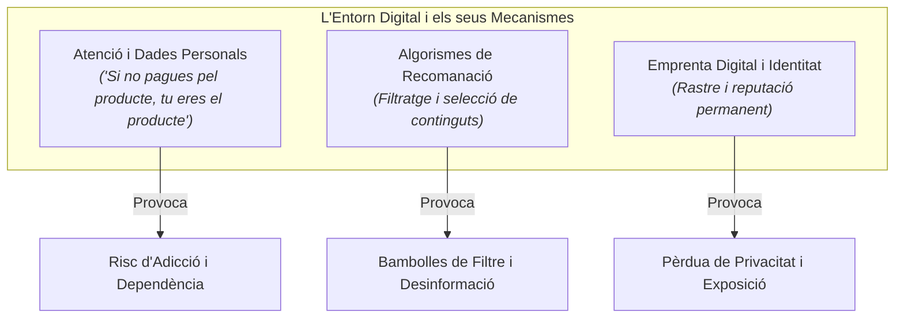
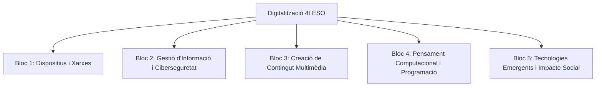
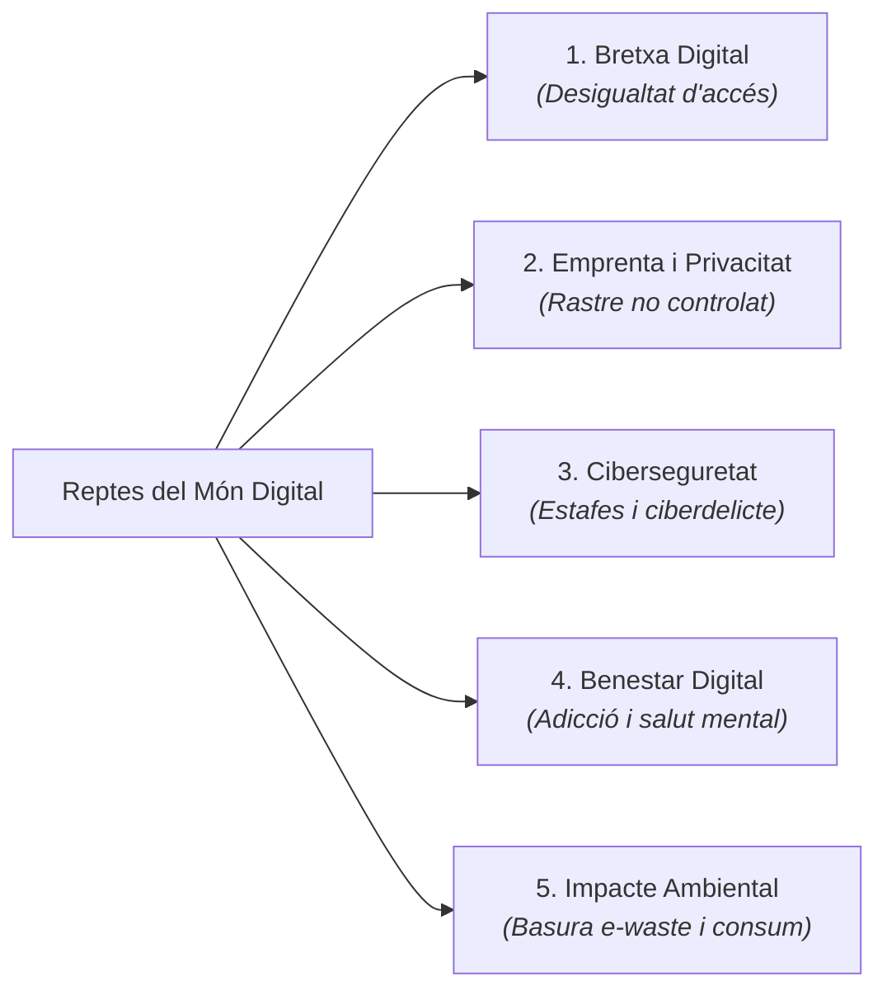
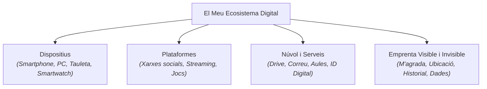

# Tema 0: Introducció a la Digitalització


*Figura 1: La xarxa global de dades i la digitalització interconnecten tots els àmbits de la societat moderna.*

---

## Taula de Continguts

<details open>
<summary><b>Índex del tema (fes clic per a desplegar o navegar)</b></summary>

- [Tema 0: Introducció a la Digitalització](#tema-0-introducció-a-la-digitalització)
  - [Taula de Continguts](#taula-de-continguts)
  - [1. Què és la Digitalització?](#1-què-és-la-digitalització)
    - [Comparativa: Mapeig del Món Analògic al Digital](#comparativa-mapeig-del-món-analògic-al-digital)
    - [Del Món Analògic al Digital: Un Salt Històric](#del-món-analògic-al-digital-un-salt-històric)
  - [2. La Necessitat de Ser Conscients del Món Digital](#2-la-necessitat-de-ser-conscients-del-món-digital)
    - [A. La Il·lusió de la "Gratuïtat" i l'Economia de l'Atenció](#a-la-illusió-de-la-gratuïtat-i-leconomia-de-latenció)
    - [B. Algorismes i Filtratge de la Realitat](#b-algorismes-i-filtratge-de-la-realitat)
    - [C. Autonomia i Identidad Digital](#c-autonomia-i-identidad-digital)
    - [D. Ciutadania Crítica i Drets Digitals](#d-ciutadania-crítica-i-drets-digitals)
  - [3. Passar d'Usuaris Passius a Ciutadans Digitals Actifs](#3-passar-dusuaris-passius-a-ciutadans-digitals-actifs)
    - [Per què esta competència és fonamental per al teu futur real?](#per-què-esta-competència-és-fonamental-per-al-teu-futur-real)
  - [4. Visió Global de l'Assignatura: Què anem a aprendre?](#4-visió-global-de-lassignatura-què-anem-a-aprendre)
    - [Taula Resum dels Continguts del Curs](#taula-resum-dels-continguts-del-curs)
  - [5. Els Grans Reptes del Món Digital](#5-els-grans-reptes-del-món-digital)
  - [6. On Estem i Cap a On Anem? El Context Tecnològic Actual](#6-on-estem-i-cap-a-on-anem-el-context-tecnològic-actual)
    - [Tendències i Vectors del Canvi Actual:](#tendències-i-vectors-del-canvi-actual)
  - [7. La Emprenta Tecnològica Personal: El Teu Ecosistema Digital](#7-la-emprenta-tecnològica-personal-el-teu-ecosistema-digital)
  - [8. Exercicis i Activitats de Consolidació Global](#8-exercicis-i-activitats-de-consolidació-global)
    - [1. Definició i conceptes bàsics (Resposta curta)](#1-definició-i-conceptes-bàsics-resposta-curta)
    - [2. Relaciona les columnes (Món Analògic vs. Món Digital)](#2-relaciona-les-columnes-món-analògic-vs-món-digital)
    - [3. Completa els buits (Mecanismes de l'entorn digital)](#3-completa-els-buits-mecanismes-de-lentorn-digital)
    - [4. Quadre comparatiu: Consumidor Passiu vs. Creador Digital Actiu](#4-quadre-comparatiu-consumidor-passiu-vs-creador-digital-actiu)
    - [5. Anàlisi d'imatge i dilema tècnic](#5-anàlisi-dimatge-i-dilema-tècnic)
    - [6. Classificació de Reptes Digitals](#6-classificació-de-reptes-digitals)
    - [7. Qüestió d'opinió fonamentada (Propietat Digital)](#7-qüestió-dopinió-fonamentada-propietat-digital)
    - [8. Anàlisi de veracitat i verificació](#8-anàlisi-de-veracitat-i-verificació)
    - [9. El Meu Ecosistema Digital](#9-el-meu-ecosistema-digital)
    - [10. Balanç Global: La Balança Digital](#10-balanç-global-la-balança-digital)
    - [Activitat d'Investigació i Indagació Inicial](#activitat-dinvestigació-i-indagació-inicial)

</details>

---

## 1. Què és la Digitalització?

Vivim en un món envoltat de pantalles, sensors, dades i intel·ligència artificial. Però, què significa realment la paraula **digitalització**?

La **digitalització** és el procés de transformar informació, processos, objectes i activitats analògiques (físiques o tradicionals) en format digital. En altres paraules, consisteix a convertir la informació del món real en un llenguatge numèric (codi binari de **zeros i uns**: `0` i `1`) que els ordinadors i dispositius electrònics poden processar, emmagatzemar, transmetre i comprendre.

### Comparativa: Mapeig del Món Analògic al Digital

```mermaid
graph LR
    subgraph MUNDO_ANALÓGICO["Món Analògic (Físic i Continu)"]
        A1[Foto en paper]
        A2[Llibre o llibreta]
        A3[Monedes i bitllets]
        A4[Carta postal]
        A5[Disc de vinil]
    end

    subgraph PROCESO["Procés de Digitalització"]
        P["Mostreig i Codificació Binària (0 i 1)"]
    end

    subgraph MUNDO_DIGITAL["Món Digital (Virtual i Discret)"]
        D1[Arxiu JPG / PNG]
        D2[Document PDF / eBook]
        D3[Bizum / Targeta Virtual]
        D4[Correu electrònic / Xat]
        D5[Arxiu MP3 / Streaming]
    end

    MUNDO_ANALÓGICO --> PROCESO --> MUNDO_DIGITAL
```



### Del Món Analògic al Digital: Un Salt Històric
- **Món Analògic**: La informació és contínua i física. Un vinil gravat amb ones de so, una fotografia revelada en carret o un expedient en paper guardat en un arxivador.
- **Món Digital**: La informació és discreta i virtual. Es representa mitjançant dades numèriques (`bits`). Això permet copiar-la infinites vegades sense cap pèrdua de qualitat, enviar-la a l'altra punta del planeta en mil·lisegons i emmagatzemar-la en espais molt reduïts (servidors, el "núvol" o memòries flash).

>  **Activitats de l'apartat:**
> 1. **Anàlisi d'objectes:** Identifica tres objectes o hàbits analògics dels teus pares o iaios i explica com s'han transformat en els seus equivalents digitals actuals.
> 2. **Debat analògic vs. digital:** Quins aspectes del món analògic (com llegir un llibre físic o escoltar un disc de vinil) creus que es perden en digitalitzar-se? Val la pena digitalitzar-ho absolutament tot?
> 3. **El repte del codi binari:** Explica amb les teues paraules per què els ordinadors necessiten convertir les imatges, vídeos i sons a zeros i uns (`0` i `1`) en comptes de processar-los directament com els veiem i oïm els humans.

---

## 2. La Necessitat de Ser Conscients del Món Digital

No vivim simplement en un món que *utilitza* tecnologia; vivim en una **societat completament digitalitzada**. La tecnologia ja no és sols una eina puntual com ho era una calculadora o una màquina d'escriure; és el **medi en què succeeixen l'economia, la informació, les relacions humanes, la política i el treball**.



Comprendre i ser conscients de l'entorn digital en què estem immersos és indispensable per diverses raons clau de la nostra vida real:

### A. La Il·lusió de la "Gratuïtat" i l'Economia de l'Atenció
Quan utilitzem xarxes socials, cercadors o plataformes sense pagar diners, solem pensar que són gratuïtes. La realitat és que **nosaltres som el producte**. La nostra atenció, les nostres cerques, els nostres gustos i les nostres dades personals són la moneda de canvi. Ser conscients d'açò ens permet decidir amb llibertat com i quan consumir tecnologia, en compte de deixar que algorismes dissenyats per a captar la nostra atenció decidisquen per nosaltres.

### B. Algorismes i Filtratge de la Realitat
Gran part de les notícies que llegim, els vídeos que ens apareixen o les recomanacions que reben estan guiades per **algorismes de recomanació**. Si no som conscients de com funcionen:
- Podem caure en **bambolles de filtre** i **càmeres de ressonància**, on sols veiem opinions amb les quals ja estem d'acord.
- Ens tornem vulnerables a la **desinformació** i a la manipulació en moments clau (eleccions, crisis de salut, tendències de consum).

### C. Autonomia i Identidad Digital
Cada interacció deixa una **emprenta digital** esborrable mai més. La nostra identitat ja no es limita a la nostra presència física; existeix una versió digital de nosaltres construïda per fotos, comentaris, ubicacions i hàbits de compra. Ser conscient del món digital significa prendre les regnes de la nostra reputació i privacitat per a evitar que condicionen el nostre futur personal i professional.

### D. Ciutadania Crítica i Drets Digitals
En el món real, ser un ciutadà informat requereix conéixer els teus drets digitals: la protecció de les teues dades personals, la neutralitat de la xarxa, la propietat intel·lectual i l'accés equitatiu a la tecnologia. Un ciutadà desinformat digitalment és més manipulable i dependent.

>  **Activitats de l'apartat:**
> 1. **Descodificant la "gratuïtat":** Pensa en l'aplicació o xarxa social que més utilitzes. Si no pagues diners per ella, de quines formes creus que l'empresa obté beneficis econòmics a partir de la teua activitat i les teues dades?
> 2. **La teua bambolla de filtre:** Reflexiona sobre els vídeos o publicacions que et suggereix la teua xarxa social preferida. Creus que et mostren opinions variades o tendeixen a ensenyar-te sempre el mateix? Per què passa açò?
> 3. **La teua emprenta inesborrable:** Alguna vegada has buscat el teu nom o el d'algú conegut en Google? Quina informació apareix i quina imatge creus que transmet sobre eixa persona?

---

## 3. Passar d'Usuaris Passius a Ciutadans Digitals Actifs

Saber lliscar la pantalla d'un smartphone o publicar un vídeo no ens converteix en experts en tecnologia. En el món real existeix una gran diferència entre ser un **consumidor passiu** i ser un **ciutadà digital proactiu, crític i creador**.

| Perfil | Actitud habitual | Relació amb la tecnologia |
| :--- | :--- | :--- |
| **Consumidor Passiu** | Consumeix continguts infinits, accepta termes sense llegir, comparteix dades alegrements, es creu tot el que veu. | És controlat per la tecnologia i els algorismes. |
| **Ciutadà Digital Actiu** | Crea continguts, programa, protegeix les seues dades, qüestiona les fonts, entén com funcionen les eines. | Utilitza la tecnologia per a resoldre problemes i millorar el seu entorn. |


*Figura 2: Treballar en equip per a crear, programar i resoldre problemes transforma el nostre paper de simples espectadors a creadors de tecnologia.*

### Per què esta competència és fonamental per al teu futur real?

1. **Comprensió de l'Entorn**: Entendre què passa "darrere de la pantalla" quan enviem un missatge, busquem en Google o interactuem amb una Intel·ligència Artificial.
2. **Capacitat de Creació i Emprenedoria**: Qui domina la tecnologia no sols la consumeix, sinó que l'utilitza per a resoldre problemes reals, crear art, dissenyar solucions, automatitzar faenes i emprendre projectes.
3. **Ciberseguretat i Protecció Personal**: En el món real hi ha amenaces tangibles (estafes bancàries, robatori d'identitat, xantatge digital). Saber defensar-se no és opcional, és una necessitat bàsica d'autoprotecció.
4. **Transformació del Mercat de Treball**: Quasi qualsevol professió actual (des de la medicina o el disseny gràfic fins a la mecànica, el dret o l'agricultura) se sustenta en sistemes digitals avançats. Dominar la digitalització obri portes reals en qualsevol camp professional.
5. **Responsabilitat Social i Ètica**: Avaluar l'impacte mediambiental de les dades, els biaixos socials que pot reproduir la Intel·ligència Artificial i defensar una societat digital més justa i inclusiva.

>  **Activitats de l'apartat:**
> 1. **Autoavaluació digital:** Fes un diagnòstic personal: en un percentatge estimat del 0% al 100%, quant de temps passes consumint contingut passivament i quant creant contingut o aprenent alguna cosa nova?
> 2. **Consumidor vs. Creador:** Posa tres exemples de projectes o faenes digitals en les quals meges de ser un simple espectador i et convertisques en un creador actiu (per exemple, editar un vídeo, programar un joc o dissenyar un lloc web).
> 3. **Ciberseguretat activa:** Identifica dos errors habituals que cometen els usuaris passius en Internet (com utilitzar la mateixa contrasenya o confiar en xarxes Wi-Fi públiques sense protecció) i proposa una solució proactiva.

---

## 4. Visió Global de l'Assignatura: Què anem a aprendre?

L'assignatura de **Digitalització de 4t d'ESO** (seguint el currículum de la Comunitat Valenciana) s'articula entorn de cinc grans blocs fonamentals:



### Taula Resum dels Continguts del Curs

| Tema / Bloc | Què estudiarem? | Exemples d'Activitats Pràctiques |
| :--- | :--- | :--- |
| **0. Introducció** | Conceptes bàsics de la digitalització, impacte social i full de ruta de l'assignatura. | Debats sobre l'ús de la tecnologia, anàlisi de l'entorn digital personal. |
| **1. Dispositius, Sistemes i Xarxes** | Programari, maquinari, arquitectures d'ordinadors, sistemes operatius i configuració de xarxes locals i Internet. | Anàlisi de components interns, ordres de xarxa, configuració de xarxes Wi-Fi. |
| **2. Gestió de la Informació, Ciberseguretat i Ciutadania** | Cerca avançada d'informació, emprenta digital, ciberseguretat, criptografia i benestar digital. | Auditoria de contrasenyes, detecció de phishing, configuració de privacitat. |
| **3. Creació de Continguts Multimèdia** | Disseny gràfic, edició d'àudio/vídeo, llicències de propietat intel·lectual (Creative Commons) i desenvolupament web. | Edició amb GIMP/Inkscape/Audacity, creació d'un lloc web accessible en HTML/CSS. |
| **4. Pensament Computacional i Programació** | Algorismes, lògica de programació, llenguatges (blocs/Python), desenvolupament d'aplicacions o robòtica. | Creació de xicotets programes, scripts d'automatització, jocs o simulacions. |
| **5. Tecnologies Emergentes i Impacte Socioeconòmic** | Intel·ligència Artificial (IA), Big Data, Internet de les Coses (IoT), ètica tecnològica i sostenibilitat. | Generació de prompts en IA, projectes de domòtica/IoT, anàlisi de biaixos en algorismes. |

>  **Activitats de l'apartat:**
> 1. **Les meues metes per al curs:** Revisa els 5 blocs del curs i tria els dos que més et criden l'atenció. Explica breument què t'agradaria aprendre a fer en ells.
> 2. **Connexió laboral:** Tria una professió que t'interesse per al futur (metge/essa, arquitecte/a, dissenyador/a, mecànic/a, docent...) i explica com es relaciona la digitalització amb eixa faena.
> 3. **Projecte integrat:** En parelles, penseu en una idea de projecte digital per al vostre centre escolar (per exemple, una app de biblioteca o un canal de ràdio escolar) i identifiqueu quins blocs de l'assignatura necessitaríeu dominar.

---

## 5. Els Grans Reptes del Món Digital

La digitalització no sols aporta avantatges; també planteja grans desafiaments que hem d'aprendre a gestionar de manera conscient i ètica:




*Figura 3: L'acumulació de residus electrònics (e-waste) i el consum energètic massiu dels centres de dades representen un greu repte mediambiental.*

- **La Bretxa Digital**: La desigualtat entre aquells que tenen accés ràpid a la tecnologia i la formació adequada, i els que en mantenen mancances per motius econòmics, geogràfics o generacionals.
- **La Emprenta Digital i la Privacitat**: Cada clic, cerca o *m'agrada* deixa un rastre de dades personals en la xarxa que moltes empreses utilitzen per a crear perfils comercials o predir comportaments.
- **La Ciberseguretat**: Virus, *ransomware*, suplantació d'identitat i ciberassetjament (*cyberbullying*) requereixen coneixements de prevenció activa.
- **L'Adicció i el Benestar Digital**: Aprendre a gestionar el temps de pantalla i desconnectar (*desintoxicació digital*) és fonamental per a mantindre la salut física i mental.
- **Impacte Ambiental de la Tecnologia**: La fabricació de microxips, el consum energètic massiu dels centres de dades (servidors i IA) i la basura electrònica (*e-waste*) generen una emprenta ecològica considerable.

>  **Activitats de l'apartat:**
> 1. **La bretxa en el teu entorn:** Coneixes a algú proper (gent gran, veïns o famílies) que tinga dificultats per a fer tràmits digitals bàsics? Quines solucions proposaries per a reduir eixa bretxa?
> 2. **Basura electrònica (*e-waste*):** Investiga què passa amb els mòbils vells o els components electrònics que es tiren al fem domèstic. Per què és crucial reciclar-los en punts nets?
> 3. **El repte del benestar digital:** Series capaç de passar 24 hores consecutives sense mirar cap pantalla (mòbil, televisió, consola, ordinador)? Quines dificultats creus que tindries?

---

## 6. On Estem i Cap a On Anem? El Context Tecnològic Actual

Estem vivint una de les transformacions més ràpides i intenses de la història de la humanitat. El panorama digital actual no és estàtic; evoluciona a un ritme vertiginós obrint interrogants fascinants sobre com serà el nostre futur pròxim.


*Figura 4: L'eclosió de la Intel·ligència Artificial i l'automatització redefiniran el treball, la creativitat i l'aprenentatge.*

### Tendències i Vectors del Canvi Actual:

1. **L'Era de la Intel·ligència Artificial Generativa**: Hem passat d'ordinadors que executen ordres preprogramades a sistemes capaços de generar text, imatges, codi o música, raonar i prendre decisions. Com canviarà açò el treball, l'art i l'aprenentatge?
2. **El Canvi de Paradigma: Del Tindre a l'Accedir (Pèrdua de Propietat)**: Abans compràvem CDs, pel·lícules en DVD, jocs físics o llicències de programari per a tota la vida. Hui paguem subscripcions mensuals per a accedir a música, cinema, videojocs i eines digitals en el núvol. Ja no som "amos" dels béns digitals, sinó llogaters temporals.
3. **Hiperconnectivitat i Internet de les Coses (IoT)**: Tot al nostre voltant (rellotges, electrodomèstics, cotxes, ciutats) està començant a recopilar dades i comunicar-se entre si en temps real.
4. **Automatització i Transformació del Treball**: Faenes mecàniques i intel·lectuals repetitives estan sent automatitzades, la qual cosa exigeix desenvolupar habilitats humanes clau com la creativitat, el pensament crític i la capacitat de resoldre problemes no estructurats.

>  **Activitats de l'apartat:**
> 1. **El dilema de la propietat digital:** Si pagues tots els mesos per vore una sèrie o jugar en el núvol i un dia retiren eixe contingut, creus que havies "comprat" alguna cosa? Quines diferències li veus respecte a tindre un disc o llibre físic?
> 2. **Ús ètic de la IA:** Si li demanes a una Intel·ligència Artificial que et faça un treball escolar i el lliures sense modificar-lo ni revisar-lo, quins dilemes ètics i problemes d'aprenentatge creus que es plantegen?
> 3. **L'ocupació del futur:** Pensa en dos professions que creus que canviaran radicalment degut a l'automatització i proposa dues habilitats humanes que cap màquina podrà reemplaçar fàcilment.

---

## 7. La Emprenta Tecnològica Personal: El Teu Ecosistema Digital

Abans de submergir-nos en els blocs tècnics, és imprescindible mapejar el nostre propi entorn. Cadascú de nosaltres viu dins d'una "bambolla digital" formada pels dispositius que utilitza, les plataformes que freqüenta, les dades que comparteix de manera conscient o inconscient i el temps que dedica a cada pantalla.



Analitzar objectivament com ens relacionem amb la tecnologia ens permet prendre el control de les nostres eines en compte de deixar que ens condicionen.

>  **Activitats de l'apartat:**
> 1. **Inventari de dispositius:** Fes una llista de tots els aparells amb connexió a Internet que hi ha a la teua casa. Quants en fas servir tu diàriament i quantes hores calcules que passes davant d'ells?
> 2. **Auditoria de permisos:** Revisa els permisos (càmera, micròfon, ubicació, contactes) de les 3 aplicacions que més utilitzes en el teu telèfon. Totes necessiten realment tots eixos permisos per a funcionar correctament?
> 3. **Estimació de dades:** Si hagueres de calcular quantes dades personals teues (fotos, ubicacions, cerques, hàbits) tenen guardades empreses de tecnologia en el núvol, quines dades creus que serien les més sensibles o privades?

---

## 8. Exercicis i Activitats de Consolidació Global

A continuació es presenten 10 activitats variades per a repassar, reflexionar i consolidar de manera individual tots els conceptes clau treballats en este tema d'introducció:

### 1. Definició i conceptes bàsics (Resposta curta)
Explica amb les teues paraules què significa **digitalitzar** una informació o procés i detalla quina funció compleix el codi binari (`0` i `1`) en els dispositius informàtics.

### 2. Relaciona les columnes (Món Analògic vs. Món Digital)
Associa cada element del **Món Analògic** (Columna A) amb la seua corresponent transformació en el **Món Digital** (Columna B):

| Columna A: Món Analògic | Columna B: Món Digital |
| :--- | :--- |
| **1.** Carta en paper enviada per correu postal | **A.** Plataforma de música en streaming (Spotify) |
| **2.** Col·lecció de CDs de música | **B.** Missatge instantani / Correu electrònic |
| **3.** Monedes i bitllets en el moneder | **C.** Arxiu PDF en el núvol |
| **4.** Expedient mèdic en una carpeta física | **D.** Signatura digital i certificat d'identitat |
| **5.** Document d'identitat en targeta física | **E.** Bizum / Pagament mòbil sense contacte |

*Escriu les teues respostes emparellant el número amb la lletra (exemple: 1-B, 2-A...)*

---

### 3. Completa els buits (Mecanismes de l'entorn digital)
Omple els espais en blanc utilitzant els següents termes: *algorismes de recomanació*, *atenció*, *emprenta digital*, *bambolla de filtre*, *gratuït*.

> a) Quan utilitzem un servei web o aplicació que és totalment _______________, hem de recordar la màxima: "Si no pagues pel producte, tu eres el producte", ja que l'empresa comercialitza amb les teues dades i la teua _______________.
> 
> b) Cada cerca, m'agrada, comentari o arxiu pujat a Internet contribueix a construir la nostra _______________ permanent en la xarxa.
> 
> c) Les plataformes utilitzen _______________ per a analitzar els teus gustos i mostrar-te continguts personalitzats, la qual cosa pot tancar-te en una _______________ on sols veus informació d'acord amb les teues preferències.

---

### 4. Quadre comparatiu: Consumidor Passiu vs. Creador Digital Actiu
Completa la següent taula assenyalant quina actitud adoptaria cada perfil davant de les situacions plantejades:

| Situació plantejada | Actitud del Consumidor Passiu | Actitud del Creador Digital Actiu |
| :--- | :--- | :--- |
| Rep un missatge cridaner sobre un sorteig en WhatsApp | | |
| Vol mostrar un projecte o faena de classe | | |
| Instal·la una nova aplicació en el seu telèfon | | |

---

### 5. Anàlisi d'imatge i dilema tècnic
Observa el següent gràfic sobre el procés de digitalització:

```
[Senyal Analògica (Ona Contínua)] ---> [Mostreig i Codificació Binària] ---> [Dades Digitals (0 i 1)]
```

Per què creus que un arxiu digital es pot copiar un milió de vegades sense perdre gens de qualitat, mentre que una cinta de vídeo VHS o un cassette analògic es deteriorava cada vegada que es copiava o es reproduïa?

---

### 6. Classificació de Reptes Digitals
De la següent llista de situacions reals, classifica cadascuna segons el **Repte del Món Digital** al qual correspon (*Bretxa Digital*, *Ciberseguretat*, *Benestar Digital*, *Impacte Ambiental*, *Privacitat*):

- **A.** Un iaio no pot demanar cita mèdica perquè la consulta sols es gestiona mitjançant una app mòbil. → _______________
- **B.** Una persona rep un correu fals que imita al seu banc demanant les seues claus d'accés. → _______________
- **C.** Sentir ansietat o necessitat de revisar el telèfon mòbil als pocs minuts de deixar-lo a la taula. → _______________
- **D.** L'enorme consum d'energia i aigua que requereixen els centres de dades que entrenen la Intel·ligència Artificial. → _______________
- **E.** Un cercador web que guarda la teua ubicació per a enviar-te publicitat de botigues properes. → _______________

---

### 7. Qüestió d'opinió fonamentada (Propietat Digital)
Si pagues una subscripció mensual en una plataforma de videojocs o sèries i la companyia decideix eliminar un títol del seu catàleg, sents que t'han quitat alguna cosa teua? Justifica la teua resposta reflexionant sobre les diferències entre **tindre un objecte físic** i **llogar accés al núvol**.

---

### 8. Anàlisi de veracitat i verificació
Imagina que et arriba un vídeo hiperrealista generat per Intel·ligència Artificial (*deepfake*) en el qual una persona famosa diu alguna cosa escandalosa. Enumera **tres passos concrets** que megeries com a ciutadà digital crític per a verificar si el vídeo és vertader o fals abans de compartir-lo.

---

### 9. El Meu Ecosistema Digital
Omple la següent plantilla amb les teues pròpies dades reals:

- **Dispositiu principal que més utilitze:** ____________________
- **Temps mitjà diari de pantalla:** ____________________
- **La meua aplicació més utilitzada:** ____________________
- **Mesura de seguretat que ja aplique:** ____________________
- **Aspecte digital que em meua comprometo a millorar este curs:** ____________________

---

### 10. Balanç Global: La Balança Digital
Redacta un text breu (d'entre 5 i 10 línies) responent a esta qüestió: En una balança global, consideres que la digitalització aporta més beneficis o més inconvenients a la societat actual? Esmenta almenys **dos punts positius** i **dos punts negatius** per a argumentar la teua postura.

---

### Activitat d'Investigació i Indagació Inicial 

> **Projectes d'Indagació:**
> 
> Trieu un dels següents temes plantejats i prepareu una breu exposició o presentació amb les vostres conclusions:
> 
> 1. **El fi de la propietat privada digital**: Investigueu què passa si una plataforma de contingut en *streaming* (música, jocs o vídeo) decideix retirar una obra del seu catàleg o tancar el vostre compte. Som realment amos d'allò que comprem digitalment?
> 2. **La paradoxa de la Intel·ligència Artificial**: Investigueu com la IA pot ajudar-nos a resoldre problemes complexos (com descobrir medicaments) però, al mateix temps, genera reptes com la desinformació massiva o el consum massiu d'aigua i electricitat en els seus servidors.
> 3. **Auditoria del teu Ecosistema Digital**: Elabora una llista de tots els dispositius, aplicacions i serveis en el núvol que utilitzes en una setmana. De quantes empreses diferents depenen? Què passaria amb les teues dades si una d'eixes empreses tancara demà?