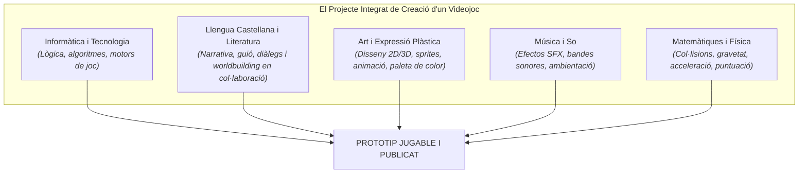
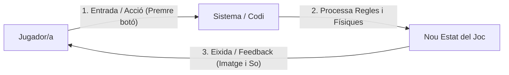
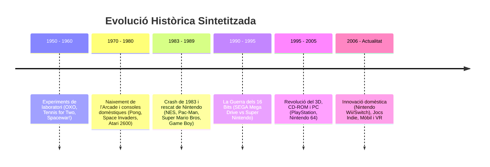
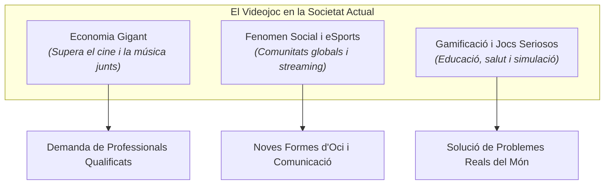
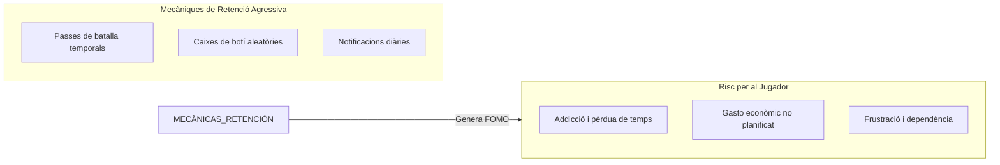
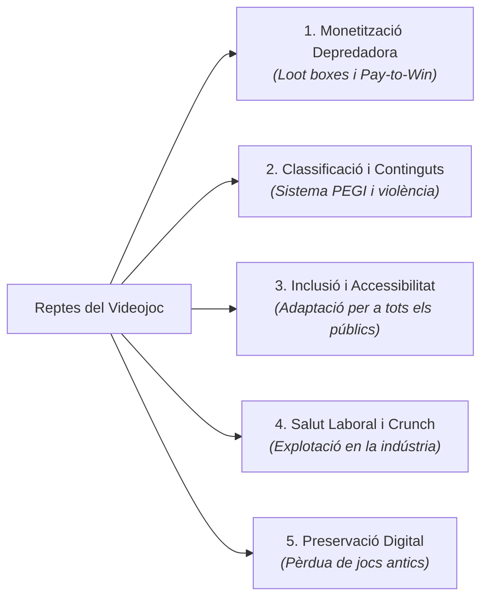

# Tema 0: Introducció al Taller de Videojocs


*Figura 1: El desenvolupament de videojocs combina art, narrativa, disseny de so i programació en un projecte creatiu únic.*

---

## Taula de Continguts

<details open>
<summary><b>Índex del tema (fes clic per a desplegar o navegar)</b></summary>

- [Tema 0: Introducció al Taller de Videojocs](#tema-0-introducció-al-taller-de-videojocs)
  - [Taula de Continguts](#taula-de-continguts)
  - [1. Benvinguts al Taller de Videojocs!](#1-benvinguts-al-taller-de-videojocs)
    - [De què tracta esta assignatura?](#de-què-tracta-esta-assignatura)
    - [Què és (realmente) un videojoc?](#què-és-realmente-un-videojoc)
      - [La diferència clau: La Interactivitat i el Bucle de Joc](#la-diferència-clau-la-interactivitat-i-el-bucle-de-joc)
    - [Els 4 Pilars d'un Videojoc (El Model MDA)](#els-4-pilars-dun-videojoc-el-model-mda)
  - [2. Resum de la Història i Evolució dels Videojocs](#2-resum-de-la-història-i-evolució-dels-videojocs)
  - [3. La Influència i Impacte dels Videojocs en la Societat](#3-la-influència-i-impacte-dels-videojocs-en-la-societat)
    - [A. Un Gegant Econòmic i Cultural](#a-un-gegant-econòmic-i-cultural)
    - [B. Mecàniques de Retenció i Economia de l'Atenció](#b-mecàniques-de-retenció-i-economia-de-latenció)
    - [C. Gamificació: Els Jocs en el Món Real](#c-gamificació-els-jocs-en-el-món-real)
    - [D. Eixides Professionals i Futur Laboral](#d-eixides-professionals-i-futur-laboral)
  - [4. Passar de Jugadors Passius a Creadors Actius](#4-passar-de-jugadors-passius-a-creadors-actius)
    - [Per què esta competència és fonamental per al teu futur real?](#per-què-esta-competència-és-fonamental-per-al-teu-futur-real)
  - [5. Els Grans Reptes de la Indústria del Videojoc](#5-els-grans-reptes-de-la-indústria-del-videojoc)
  - [6. On Estem i Cap a On Ens Dirigim? El Context Tecnològic Actual](#6-on-estem-i-cap-a-on-ens-dirigim-el-context-tecnològic-actual)
    - [Tendències i Vectors del Canvi Actual](#tendències-i-vectors-del-canvi-actual)
  - [7. Exercicis i Activitats de Consolidació Globals](#7-exercicis-i-activitats-de-consolidació-globals)
    - [1. Definició i conceptes bàsics (Resposta curta)](#1-definició-i-conceptes-bàsics-resposta-curta)
    - [2. Relaciona les columnes (Conceptes i Història del Videojoc)](#2-relaciona-les-columnes-conceptes-i-història-del-videojoc)
    - [3. Completa els buits (Pilares i Mecàniques)](#3-completa-els-buits-pilares-i-mecàniques)
    - [4. Quadre comparatiu: Jugador Passiu vs. Dissenyador/Creador Activo](#4-quadre-comparatiu-jugador-passiu-vs-dissenyadorcreador-activo)
    - [5. Anàlisi de diagrama i lògica del joc](#5-anàlisi-de-diagrama-i-lògica-del-joc)
    - [6. Classificació de Reptes de la Indústria](#6-classificació-de-reptes-de-la-indústria)
    - [7. Qüestió d'opinió fonamentada (Són els videojocs art?)](#7-qüestió-dopinió-fonamentada-són-els-videojocs-art)
    - [8. Anàlisi ètic de mecàniques de monetització](#8-anàlisi-ètic-de-mecàniques-de-monetització)
    - [9. El meu Perfil de Creador/a Gamer](#9-el-meu-perfil-de-creadora-gamer)
    - [10. Balanç Global: La Balança del Videojoc](#10-balanç-global-la-balança-del-videojoc)
    - [Activitat d'Investigació i Indagació Inicial](#activitat-dinvestigació-i-indagació-inicial)

</details>

---

## 1. Benvinguts al Taller de Videojocs!

Hola i benvinguts a l'assignatura **Taller de Videojocs** per a 4t d'ESO!

Si estàs llegint açò, és molt probable que en algun moment de la teua vida hagis gaudit jugant amb una consola, un ordinador o el teu propi telèfon mòbil. Els videojocs formen part de les nostres vides quotidianes, del nostre oci i de la cultura popular contemporània. Tanmateix, en esta assignatura no ens limitarem a ser **jugadors (consumidors)**: anem a fer el salt a l'altre costat de la pantalla per a convertir-nos en **creadors, dissenyadors i desenvolupadors**.

### De què tracta esta assignatura?
En **Taller de Videojocs** aprendràs a concebir, dissenyar, construir i publicar el teu propi videojoc jugable des de zero. Crear un videojoc és un repte multidisciplinari únic; no consisteix sols a escriure línies de codi informàtic, sinó a combinar harmaciosament diferents disciplines del saber humà:



* **Informàtica i Tecnologia:** Lògica de programació, estructures de dades, gestió d'esdeveniments i ús de motors de joc (*Game Engines*).
* **Llengua Castellana i Literatura (Narrativa i Guió):** En col·laboració directa amb l'assignatura de Castellà, treballarem la creació de mons (*worldbuilding*), el desenvolupament de personatges, l'estructura de l'arc narratiu i el disseny de diàlegs i històries interactives.
* **Art i Expressió Plàstica:** Disseny de personatges, escenaris, animació 2D (*sprites*), modelat 3D i interfícies visuals.
* **Música i So:** Composició de música d'ambient, efectes sonors (*SFX*) i disseny auditiu emocional.
* **Matemàtiques i Física:** Càlcul de coordenades, sistemes de puntuació, detecció de col·lisions i simulació de moviment (gravetat, salts, rebots).

---

### Què és (realmente) un videojoc?

Encara que tots reconeixem un videojoc a l'instant, definir-lo formalment ens ajuda a entendre els engranatges que funcionen davall de la superfície:

> **Definició Formal:**  
> Un **videojoc** és un sistema digital i interactiu d'entreteniment en què un o diversos jugadors prenen decisions a través d'un dispositiu d'entrada (comandament, teclat, ratolí, pantalla tàctil, sensor) per a modificar l'estat d'un món virtual que respon en temps real amb retroalimentació visual, auditiva i/o hàptica, seguint un conjunt de regles prèviament dissenyades.

#### La diferència clau: La Interactivitat i el Bucle de Joc
A diferència del cine, la televisió o la lectura d'un llibre —on l'espectador és un observador passiu—, en el videojoc **el jugador és el protagonista actiu**. Sense les decisions i accions del jugador, l'experiència s'atura per complet.



---

### Els 4 Pilars d'un Videojoc (El Model MDA)

En la indústria professional del videojoc s'utilitza la metodologia **MDA** (*Mechanics, Dynamics, Aesthetics*) complementada amb la tecnologia per a estructurar qualsevol obra:

| Pilar | Descripció | Exemple Pràctic |
| :--- | :--- | :--- |
| **Mecàniques (Mechanics)** | Les regles bàsiques, accions i algoritmes que defineixen què es pot fer. | Saltar, disparar, ARREPLEGAR monedes, obrir inventari, temps límit. |
| **Estètica i Art (Aesthetics)** | La resposta emocional i visual que transmet el joc (gràfics, so, interfície). | Estil *Pixel Art* retro, música de misteri, gràfics 3D realistes. |
| **Narrativa (Narrative)** | El guió, els personatges, l'univers i el motiu pel qual es lluita. | Un robot explorador ha de salvar el seu planeta abans que s'esgote la bateria. |
| **Tecnologia (Technology)** | El motor de joc, la plataforma hardware i el codi que ho sosté tot. | Godot Engine, Unity, Scratch, PC, Consola Nintendo Switch, Pantalla tàctil. |


*Figura 2: La consola Nintendo Switch i els seus comandaments representen l'evolució de la interactivitat directa entre els jugadors i el món digital.*

> **Activitats de l'apartat:**
> 1. **Anàlisi d'un clàssic:** Tria un videojoc clàssic com *Tetris* o *Pac-Man* i identifica els seus 4 pilars (Mecàniques, Art, Narrativa i Tecnologia).
> 2. **El poder de la interactivitat:** Piensa en la teua pel·lícula favorita. Com canviaria la història si fora un videojoc interactiu en què tu prens les decisions?
> 3. **Mapeig multidisciplinari:** Quina part del desenvolupament d'un videojoc creus que se et donarà millor (programació, dibuix, guió o música) i per què?

---

## 2. Resum de la Història i Evolució dels Videojocs

Per a dissenyar els jocs del futur és imprescindible conéixer el camí recorregut. La història del videojoc és una aventura apassionant de creativitat, gires tecnològiques i superació que abraça més de set dècades d'innovació:




*Figura 3: L'evolució des dels salons arcade dels anys 70 fins a les consoles híbrides actuals marca el rumb de la indústria.*

> **Activitat de l'apartat: Cronograma del Hardware Icònic**  
> Realitza una línia del temps o cronograma a la teua llibreta o document digital centrat en l'aparició del **hardware més emblemàtic** de la indústria (màquines Arcade, sistemes d'emulació com MAME, Atari 2600, NES, Super Nintendo / SNES, SEGA Mega Drive, Game Boy, Sony PlayStation / PS1, Nintendo 64, Nintendo Switch...).  
> Per a cada sistema o hardware icònic has de detallar:
> 1. **Companyia creadora i època de llançament.**
> 2. **Novedat o innovació tecnològica clau que va introduir** (per exemple: moneders i interacció pública en Arcades, cartutxos magnètics intercanviables, salt als 16 bits, emmagatzematge massiu en CD-ROM, stick analògic per a entorns 3D, preservació històrica mitjançant MAME, concepte híbrid sobretaula/portàtil...).
> 3. **Un joc icona** que demostrara el potencial d'eixe hardware.

> **Estudi a fons:**  
> En el [Tema 1: Història i Evolució dels Videojocs](../Tema%201%20-%20Historia%20dels%20videojocs/historia_val.md) analitzarem en profunditat cadascuna d'estes fases històriques, els seus autors clau (com Shigeru Miyamoto o Ralph Baer), la crisi del Crash de 1983 i l'evolució del hardware.

---

## 3. La Influència i Impacte dels Videojocs en la Societat

Els videojocs han deixat de ser un simple passatemps infantil per a convertir-se en el **mitjà de comunicació i entreteniment més influent del segle XXI**.



### A. Un Gegant Econòmic i Cultural
La indústria del videojoc factura a l'any **més ingressos econòmics que les indústries del cine i de la música combinades**. Espanya i la Comunitat Valenciana alberguen desenes d'estudis independents (*indies*) i empreses tecnològiques que generen ocupació d'alta qualificació.

### B. Mecàniques de Retenció i Economia de l'Atenció
Molts videojocs moderns (especialment els jocs mòbils i *Free-to-Play*) estan dissenyats minuciosament per a captar la nostra atenció durant hores mitjançant psicologia conductual:
- **Esdeveniments diaris i passes de batalla:** Creen l'efecte *FOMO* (*Fear Of Missing Out* o por a perdre's alguna cosa) per a obligar a connectar-se cada dia.
- **Microtransaccions i Loot Boxes (Caixes de Botí):** Dissenys comercials que conviden a gastar diners reals dins del joc per a aconseguir aspectes estètics o avantatges competitius.
- **Sistemes de recompensa variable:** Mecàniques similars a les dels jocs d'atzar que lliberen dopamina en el cervell en rebre premis aleatoris.

Entendre estes mecàniques ens permet jugar amb **autonomia, autocontrol i sentit crític**, evitant caure en hàbits de consum poc saludables.



### C. Gamificació: Els Jocs en el Món Real
La **gamificació** consisteix a aplicar dinàmiques, regles i elements propis dels videojocs en entorns no lúdics per a motivar i resoldre problemes reals:
- **Educació:** Plaques d'aprenentatge, simuladors (*Minecraft Education*, *Kahoot!*).
- **Medicina:** Videojocs terapèutics per a rehabilitació motora o estimulació cognitiva.
- **Entrenament Professional:** Simuladors de vol per a pilots i simuladors quirúrgics per a metges.

### D. Eixides Professionals i Futur Laboral
El desenvolupament de videojocs obri les portes a professions emergents de gran projecció:
1. **Programador/a de Videojocs:** Escriu la lògica, físiques i sistemes del joc.
2. **Game Designer (Dissenyador/a de Joc):** Dissenya les regles, l'equilibri (*balancing*) i l'experiència del jugador.
3. **Guionista / Narrative Designer:** Escriu la història, diàlegs i missions (recolzant-se en competències lingüístiques).
4. **Artista 2D/3D i Animador/a:** Crea els personatges, entorns i efectes visuals.
5. **Dissenyador/a de So i Compositor/a:** Dissenya l'apartat auditiu i la música.
6. **Tester / QA (Quality Assurance):** Detecta fallades informàtiques (*bugs*) i avalua la jugabilitat.

> **Activitats de l'apartat:**
> 1. **Anàlisi de retenció:** Identifica una mecànica en un joc que jugues habitualment (per exemple, *Fortnite*, *Brawl Stars* o *Clash Royale*) dissenyada per a connectar-te tots els dies.
> 2. **Dissenya una app gamificada:** Piensa com gamificaries una faena quotidiana que et resulte avorrida (com arreplegar la teua habitació o estudiar vocabulari) utilitzant punts, nivells o recompenses.
> 3. **Perfils de la indústria:** Si hagueres de fundar el teu propi estudi de desenvolupament amb 3 companys/es de classe, quin rol assumiria cadascú?

---

## 4. Passar de Jugadors Passius a Creadors Actius

Saber jugar molt bé a un joc o tindre nivell alt en un eSport no et converteix automàticament en dissenyador de videojocs. Existeix un salt fonamental entre ser un **jugador passiu** i convertir-se en un **creador actiu i crític**.

| Perfil | Actitud habitual | Relació amb el videojoc |
| :--- | :--- | :--- |
| **Jugador Passiu** | Juga sense preguntar-se com funciona, consumeix continguts de forma il·limitada, es frustra si perd i gasta diners impulsivament. | És consumit i controlat pel disseny del joc. |
| **Creador / Dissenyador Actiu** | Analitza les mecàniques, comprén per què un nivell és divertit, busca fallades (*bugs*), programa les seues idees i respecta les regles de disseny. | Utilitza el videojoc com a mitjà d'expressió artística i tècnica. |


*Figura 4: Aprendre a col·laborar en equip per a dissenyar nivells, crear històries i programar canvia la nostra perspectiva del món digital.*

### Per què esta competència és fonamental per al teu futur real?

1. **Pensament Computacional i Lògic:** Aprendràs a desglossar una idea complexa (ex: "un enemic em persegueix i dispara") en instruccions elementals que un ordinador pot processar pas a pas.
2. **Creativitat i Expressió Narrativa:** A través de la col·laboració amb l'assignatura de Castellà, seràs capaç d'estructurar històries interactives on les decisions del jugador modifiquen el rumb del relat.
3. **Gestió de Projectes i Treball Col·laboratiu:** Un videojoc no es fa en solitari. Treballaràs en equip planificant fases, repartint rols i complint terminis reals.
4. **Anàlisi Crític de Mecàniques:** Passaràs de dir *"este joc m'agrada"* a raonar *"este joc funciona perquè la seua corba de dificultat està ben ajustada i la recompensa és justa"*.

> **Activitats de l'apartat:**
> 1. **Autodesavaluació:** Et consideres actualment un jugador purament consumidor o un creador curiós? Què t'agradaria canviar este curs?
> 2. **El 'Bug' com a oportunitat:** Recorda alguna fallada o *bug* graciós que hagis vist en un joc. Quina part del codi creus que va fallar perquè açò ocorreguera?
> 3. **Desglossament d'accions:** Escriu pas a pas (com un algoritme) totes les instruccions necessàries perquè un personatge salte sobre una plataforma quan prem la barra espaciadora.

---

## 5. Els Grans Reptes de la Indústria del Videojoc

Igual com ocorre en el món digital general, l'univers dels videojocs afronta dilemes ètics, socials i tècnics que hem de comprendre com a creadors conscients:




*Figura 5: La preservació del videojoc clàssic i la responsabilitat en el disseny són reptes fonamentals per a la cultura digital.*

- **Monetització Depredadora (*Pay-to-Win* i Caixes de Botí):** El dilema ètic entre dissenyar per a divertir o dissenyar per a exprimir econòmicament l'usuari mitjançant apostes encobertes.
- **Classificació per Edats (Codi PEGI / ESRB):** La responsabilitat d'etiquetar correctament el contingut (violència, llenguatge soez, compres integrades) per a protegir els menors.
- **Inclusió, Diversitat i Accessibilitat:** Crear jocs accessibles per a persones amb diversitat funcional motora, visual o auditiva (comandaments reassignables, paletes per a daltonisme, subtítols per a sords) i representar la diversitat social amb respecte.
- **Condicions Laborals (*Crunch*):** La problemàtica de les jornades de faena excessives no pagades en els grans estudis abans dels llançaments.
- **Preservació del Videojoc i Propietat Digital:** Quan un joc és exclusivament online o requereix servidors que l'empresa apaga, el joc desapareix per a sempre. Com protegim la història digital?

> **Activitats de l'apartat:**
> 1. **Investiga el codi PEGI:** Busca què signifiquen les etiquetes PEGI 3, PEGI 7, PEGI 12, PEGI 16 i PEGI 18 i quines són les descripcions de contingut.
> 2. **Disseny accessible:** Piensa en un joc on el jugador siga daltònic. Quins canvis faries en la paleta de colors o formes perquè poguera jugar sense problemes?
> 3. **Debat sobre preservació:** Si vas comprar un videojoc en versió digital i l'empresa tanca el seu servidor 5 anys després impedint-te jugar, et sembla just? Argumenta la teua postura.

---

## 6. On Estem i Cap a On Ens Dirigim? El Context Tecnològic Actual

El desenvolupament de videojocs evoluciona a un ritme vertiginós impulsat per la innovació tècnica:


*Figura 6: La Realidad Virtual (VR), el Cloud Gaming i la Intel·ligència Artificial estan redefinint les fronteres de la immersió.*

### Tendències i Vectors del Canvi Actual

1. **Intel·ligència Artificial en el Desenvolupament:** Eines d'IA que ajuden a generar codi, redactar diàlegs secundaris, crear textures, compondre música o simular comportaments de NPCs (*Non-Playable Characters*) molt més intel·ligents i realistes.
2. **Democratització amb Motors 'Open Source' i Accessibles:** Motors com **Godot Engine** (gratuït i de codi obert) o eines visuals com Construct i Scratch permeten a estudis de 1 persona o estudiants d'ESO crear jocs professionals sense pressupostos milionaris.
3. **L'Auge de l'Escena 'Indie' (Independent):** Jocs amb pressupostos xicotets però amb idees genials (*Minecraft*, *Hollow Knight*, *Celeste*, *Undertale*, *Balatro*) superen sovint en èxit a produccions de centenars de milions de dòlars.
4. **Joc en el Núvol (*Cloud Gaming*) i Realitat Virtual (VR):** Servidors remots que processen el joc en streaming a qualsevol pantalla (mòbil, TV) i visors que introdueixen el jugador físicament dins de l'escenari.

> **Activitats de l'apartat:**
> 1. **Fenomen Indie:** Busca informació sobre el desenvolupament de *Celeste* o *Hollow Knight*. Quantes persones formaven l'equip de desenvolupament?
> 2. **IA en els jocs:** En quins aspectes creus que la Intel·ligència Artificial pot millorar un videojoc i en quins creus que el toc humà continua sent insubstituïble?
> 3. **El motor del curs:** Investigagueu sobre el motor **Godot Engine** i per què és una de les eines més recomanades per a l'educació i el desenvolupament independent.

---

## 7. Exercicis i Activitats de Consolidació Globals

A continuació es presenten 10 activitats variades per a repassar, reflexionar i consolidar de manera individual tots els conceptes clau treballats en este tema d'introducció:

### 1. Definició i conceptes bàsics (Resposta curta)
Explica amb les teues pròpies paraules què és un **videojoc** i detalla per què la **interactivitat** el diferencia d'altres mitjans d'entreteniment com el cine o la literatura.

### 2. Relaciona les columnes (Conceptes i Història del Videojoc)
Associa cada fita o concepte de la **Columna A** amb la seua corresponent definició o repercussió en la **Columna B**:

| Columna A | Columna B |
| :--- | :--- |
| **1.** Model MDA | **A.** Primera consola domèstica que utilitzava cartutxos intercanviables. |
| **2.** Crash de 1983 | **B.** Metodologia basada en Mecàniques, Estètica i Narrativa. |
| **3.** Atari 2600 | **C.** Fallida massiva de la indústria per falta de control de qualitat. |
| **4.** Godot Engine | **D.** Plataforma digital clau per a la distribució de jocs indie. |
| **5.** Steam / itch.io | **E.** Motor de jocs gratuït i de codi obert accessible per a educació. |

*Escriu les teues respostes aparellant el número amb la lletra (exemple: 1-B, 2-C...)*

---

### 3. Completa els buits (Pilares i Mecàniques)
Ompli els espais en blanc utilitzant els termes següents: *Game Loop*, *Mecàniques*, *FOMO*, *GDD*, *Interactivitat*.

> a) Les regles i accions que determinen el que el jugador pot fer dins del joc s'anomenen _______________.
> 
> b) El document tècnic on s'especifica tota la visió, regles i art d'un projecte abans de programar s'anomena _______________.
> 
> c) El cicle bàsic repetitiu d'entrada, processament i eixida gràfica en temps real es coneix com a _______________.
> 
> d) Les promocions per temps limitat en jocs mòbils generen l'efecte _______________ per a evitar que l'usuari deixe de connectar-se.

---

### 4. Quadre comparatiu: Jugador Passiu vs. Dissenyador/Creador Activo
Completa la taula següent assenyalant quina actitud adoptaria cada perfil davant de les situacions plantejades:

| Situació plantejada | Actitud del Jugador Passiu | Actitud del Creador / Dissenyador Actiu |
| :--- | :--- | :--- |
| Es troba amb un nivell extremadament difícil | | |
| Veu una fallada visual o *bug* on el personatge travessa una paret | | |
| Rep un missatge per a comprar una caixa de botí aleatòria | | |

---

### 5. Anàlisi de diagrama i lògica del joc
Observa el següent esquema simplificat del Bucle de Joc (*Game Loop*):

```
[Premre Tecla 'Fletxa Dreta'] ---> [Sumar +5 a Posició_X del Personatge] ---> [Redibuixar Sprite en Pantalla]
```

Explica què ocorreria en la pantalla si el programador oblida incloure la part de *Redibuixar Sprite en Pantalla* encara que el codi continue sumant +5 a la posició interna.

---

### 6. Classificació de Reptes de la Indústria
Classifica cadascuna de les situacions següents segons el **Repte de la Indústria del Videojoc** a què correspon (*Monetització Depredadora*, *Inclusió i Accessibilitat*, *Classificació PEGI*, *Preservació Digital*, *Salut Laboral / Crunch*):

- **A.** Un joc que afegeix l'opció de canviar els botons perquè una persona amb mobilitat reduïda puga jugar amb una sola mà. → _______________
- **B.** Programadors treballant 14 hores diàries durant 3 mesos seguits per a acabar un joc a temps. → _______________
- **C.** Una botiga digital que tanca els seus servidors impedint tornar a descarregar jocs antics pagats. → _______________
- **D.** Un avís en la portada del joc indicando que conté compres dins de l'aplicació i violència moderada. → _______________
- **E.** Un cofre virtual que exigeix pagar 2€ reals per una probabilitat del 1% d'aconseguir una espasa llegendària. → _______________

---

### 7. Qüestió d'opinió fonamentada (Són els videojocs art?)
Redacta un text argumentatiu d'entre 6 i 10 línies responend a la pregunta: *Consideres que els videojocs haurien de ser reconeguts oficialment com a la 8a Art, a l'altura de la pintura, el cine o la música?* Recolza't en elements com la narrativa, la música i la direcció artística per a fonamentar la teua postura.

---

### 8. Anàlisi ètic de mecàniques de monetització
Imagina que estàs dissenyant un videojoc per a mòbils. Explica la diferència entre un model de monetització **ètic** (ex: vendre aspectes estètics opcionals sense avantatge) i un model **depredador** (ex: impedir avançar en el joc si no pagues diners reals o esperar 24 hores).

---

### 9. El meu Perfil de Creador/a Gamer
Ompli la plantilla següent amb les teues dades reals:

- **Plataforma principal on solc jugar:** ____________________
- **El meu videojoc favorit de tots els temps:** ____________________
- **Àrea en la qual m'agradaria col·laborar més en el meu equip (Programación / Art / Guió / So):** ____________________
- **Un hàbit de joc responsable que hem compromet a mantindre:** ____________________
- **Nom de fantasia per al nostre futur estudi de videojocs de classe:** ____________________

---

### 10. Balanç Global: La Balança del Videojoc
Redacta una reflexió final (d'entre 5 i 10 línies): En la balança global de la societat, creus que els videojocs aporten més beneficis (educació, cultura, treball en equip, entreteniment) o més riscs (addicció, sedentarisme, despeses impulsives)? Justifica la teua resposta aportant **dos arguments a favor** i **dues mesures de prevenció**.

---

### Activitat d'Investigació i Indagació Inicial

> **Projectes d'Indagació:**
> 
> 1. **La història del desenvolupament independent (Indie)**: Investigat la història de *Minecraft* o *Balatro*. Com van aconseguir creadors en solitari superar en vendes a superproduccions milionàries?
> 2. **Jocs amb impacte social (Serious Games)**: Investigat sobre videojocs creats específicament per a conscienciar sobre el canvi climàtic, la salut mental o la història (exemple: *Gris*, *Never Alone*, *Through the Darkest of Times*).
> 3. **Auditoria del teu videojoc favorit**: Selecciona un joc i esbrina amb quin motor (*Game Engine*) va ser desenvolupat (Unity, Unreal Engine, Godot, motor propi...) i de quantes persones constava l'equip de desenvolupament.
