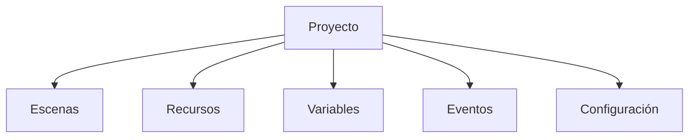

# 1. Modelo mental y primer proyecto

## 1.1. Qué es GDevelop

GDevelop es un motor para crear juegos y experiencias interactivas. Su característica principal es el sistema de eventos: expresamos reglas mediante condiciones y acciones en lugar de escribir todo el programa línea a línea.

Un proyecto de GDevelop reúne escenas, objetos, imágenes, sonidos, fuentes, variables, eventos y ajustes de exportación.

## 1.2. Instalar o abrir GDevelop

1. Abre la versión web o instala la aplicación de escritorio.
2. Crea un proyecto vacío.
3. Ponle un nombre reconocible, por ejemplo `ExpedicionLuna`.
4. Guarda el proyecto en una carpeta propia.
5. Abre la escena inicial y localiza la vista previa.

La versión web y la aplicación instalada comparten los conceptos. Puede cambiar la ubicación de algunos comandos, pero no la lógica de trabajo.

### Paso a paso: crear el proyecto de Luna

1. Abre GDevelop y elige la opción para crear un proyecto nuevo.
2. Selecciona un proyecto vacío. Las plantillas son útiles más adelante, pero empezar desde cero ayuda a entender cada pieza.
3. Escribe `ExpedicionLuna` como nombre del proyecto.
4. Elige una carpeta fácil de localizar. No guardes el proyecto dentro de la carpeta de descargas si vas a trabajar en equipo.
5. Abre la escena que GDevelop crea automáticamente. Renómbrala como `Menu`.
6. Crea una segunda escena llamada `Bosque`.
7. Guarda el proyecto y abre la vista previa.

**Resultado esperado:** la vista previa se abre y muestra una escena vacía. Que esté vacía no significa que haya un error: todavía no hemos añadido objetos.

**Si no ocurre:** comprueba que el proyecto está guardado, que has abierto la escena correcta y que no hay otra ventana de vista previa oculta detrás del editor.

## 1.3. Las zonas de trabajo

| Zona | Función |
| :--- | :--- |
| Gestor del proyecto | Acceder a escenas, recursos, extensiones y ajustes. |
| Editor de escenas | Colocar instancias y preparar el aspecto de una pantalla. |
| Editor de eventos | Crear las reglas del juego. |
| Vista previa | Ejecutar el proyecto sin publicarlo. |
| Depurador | Observar valores, objetos y estados durante la ejecución. |
| Barra de herramientas | Guardar, deshacer, rehacer y lanzar pruebas. |

*Figura 1.1: La interfaz reúne el gestor del proyecto, el editor de escenas y el editor de eventos. Imagen: documentación oficial de GDevelop.*

### Cómo orientarse sin memorizar todos los botones

Piensa en tres preguntas:

1. **¿Qué estoy viendo?** Abre una escena para editar su aspecto o sus eventos.
2. **¿Qué quiero colocar?** Usa el panel de objetos y arrastra una instancia a la escena.
3. **¿Qué quiero que ocurra?** Abre los eventos y combina condiciones con acciones.

El gestor organiza el proyecto, el editor de escenas prepara el espacio y el editor de eventos describe el comportamiento. La vista previa es el momento en el que esas tres partes se convierten en una experiencia jugable.

### Paso a paso: localizar una escena y sus eventos

1. En el gestor del proyecto, selecciona `Bosque`.
2. Observa el área central: estás en el editor de escenas.
3. Busca la pestaña o el botón de eventos de esa escena.
4. Abre la hoja de eventos. Al principio estará vacía.
5. Vuelve al editor de escenas y añade cualquier objeto de prueba.
6. Regresa a los eventos y comprueba que la escena sigue siendo la misma.

**Idea importante:** cada escena puede tener una hoja de eventos propia. Si una regla solo afecta a `Bosque`, es normal escribirla allí. Las reglas compartidas por varias escenas se pueden reutilizar más adelante con eventos externos.

## 1.4. Coordenadas y tiempo

En una escena 2D, el origen suele estar en la esquina superior izquierda. La coordenada `X` aumenta hacia la derecha y `Y` hacia abajo. El tamaño de la ventana de juego y el zoom del editor son cosas distintas.

Los juegos se actualizan muchas veces por segundo. Por eso conviene usar el **tiempo transcurrido** (*time delta*) en los movimientos calculados con eventos o JavaScript: así la velocidad no depende tanto de la potencia del ordenador.

### Leer una posición

Imagina que un objeto tiene posición `X = 300` e `Y = 120`:

- `300` indica que está 300 unidades a la derecha del origen.
- `120` indica que está 120 unidades por debajo del origen.
- no significa que esté en el píxel 300 de la pantalla si la cámara está desplazada;
- cambiar el zoom del editor no cambia esos valores.

La posición describe **dónde está la instancia**. El tamaño describe cuánto ocupa. El ángulo describe cómo está girada. Son propiedades distintas.

### Mini experimento

1. Coloca un objeto en la escena.
2. Anota sus valores X e Y.
3. Arrástralo hacia la derecha y observa qué valor aumenta.
4. Arrástralo hacia abajo y observa qué valor aumenta.
5. Cambia el zoom del editor y confirma que la posición no cambia.

Este experimento sirve para distinguir el espacio de trabajo del editor de la posición real dentro del juego.

## 1.5. Primer ejercicio

Crea una escena llamada `Bosque`, añade un fondo y prueba la vista previa. Después responde:

1. ¿Qué diferencia hay entre una escena y un objeto?
2. ¿Qué zona usarías para cambiar la posición de una instancia?
3. ¿Qué botón utilizarías para probar el juego sin exportarlo?

### Comprobación guiada

Tu proyecto está preparado si puedes señalar:

- una escena llamada `Menu`;
- una escena llamada `Bosque`;
- una hoja de eventos asociada a `Bosque`;
- una vista previa que se abre sin publicar el juego.

Si falta algo, corrígelo ahora. En GDevelop, solucionar una pequeña duda al principio evita que un error se mezcle después con objetos, variables y eventos.

## Idea clave

Un proyecto no es todavía un juego jugable. Es un conjunto organizado de datos y reglas. La jugabilidad aparece cuando las instancias reaccionan a los eventos durante la ejecución.
