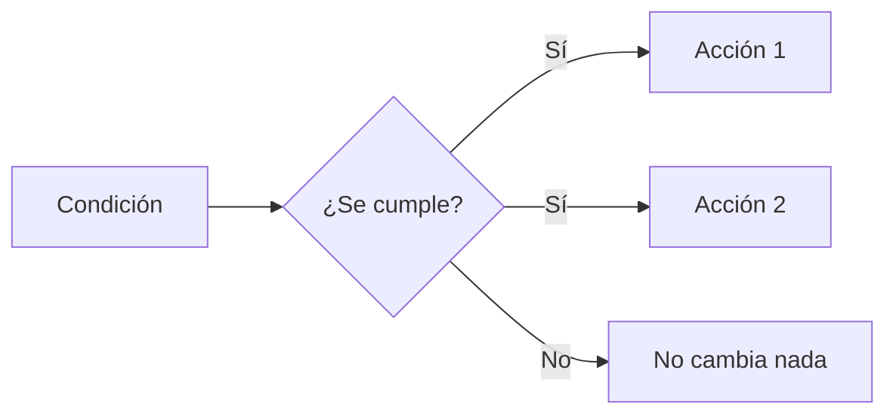

# 3. Eventos y lógica visual

## 3.1. La regla fundamental

Un evento se puede leer así:

### Crear un evento desde cero

1. Abre los eventos de la escena `Bosque`.
2. Pulsa **Añadir evento**.
3. En la fila nueva, pulsa **Añadir condición**.
4. Escribe en el buscador una palabra sencilla, como `colisión`, `tecla` o `variable`.
5. Selecciona los objetos o valores que la condición solicite.
6. En la misma fila, pulsa **Añadir acción**.
7. Busca el resultado que quieres producir, como `eliminar objeto`, `cambiar texto` o `modificar variable`.
8. Guarda y prueba.

No intentes construir cinco reglas a la vez. Después de cada evento, abre la vista previa y comprueba una sola cosa.

> **Si se cumple una condición, ejecuta una o varias acciones.**

Las condiciones preguntan por el estado del juego. Las acciones modifican objetos, variables, escenas, sonidos o efectos.



### Construcción detallada del evento

1. Añade un evento vacío.
2. En la condición de colisión, elige `Luna` como primer objeto y `Cristal` como segundo.
3. Añade la acción para eliminar la instancia de `Cristal` que participa en la colisión. No elimines todas las instancias del objeto.
4. Crea la variable de escena `Cristales` y establece su valor inicial en 0 mediante un evento de inicio.
5. Añade la acción **cambiar el valor de una variable** y selecciona `Cristales`.
6. Elige la operación de sumar y escribe `1`.
7. En otro evento sin condiciones, actualiza el texto con una expresión equivalente a `"Cristales: " + ToString(Cristales)`.
8. Prueba tocando un cristal.

**Resultado esperado:** desaparece solo el cristal tocado y el contador aumenta exactamente una unidad.

**Error típico:** si el contador aumenta continuamente, la acción de sumar está en un evento sin condición. Muévela al evento de colisión.

## 3.2. Eventos sin condiciones

### Cómo elegir una condición

Hazte esta pregunta: **¿qué hecho debe ser verdadero justo antes de la acción?**

- "Cuando Luna toca un cristal" necesita una condición de colisión.
- "Mientras se pulsa izquierda" necesita una condición de teclado.
- "Cuando quedan cero vidas" necesita una comparación de variable.
- "Solo al entrar en la escena" necesita una condición de inicio.
- "Después de tres segundos" necesita un temporizador.

Una condición no hace nada por sí sola. Solo selecciona cuándo se permiten las acciones de la fila.

Puedes usar:

### Cómo elegir una acción

Describe el cambio con un verbo: **mover**, **crear**, **borrar**, **sumar**, **mostrar**, **reproducir** o **cambiar**. Si no puedes decir qué cambia, todavía no has definido bien la regla.

Ejemplo: "Si Luna toca un cristal, **borrar** el cristal, **sumar** un punto y **reproducir** un sonido". Son tres acciones distintas dentro de una misma regla.
En la escena `Bosque`, crea un evento con estas condiciones y acciones:

**Condición:** Luna está en colisión con Cristal.

**Acciones:**

1. Eliminar la instancia de Cristal en colisión.
2. Sumar 1 a la variable `Cristales`.
3. Reproducir un sonido breve.
4. Actualizar el texto de la interfaz.

### Crear y utilizar una variable de escena

1. Abre las variables de la escena `Bosque`.
2. Crea una variable llamada `Cristales`.
3. Elige un valor inicial numérico: `0`.
4. En el evento de colisión, suma `1`.
5. En la condición de victoria, compara `Cristales` con `3`.
6. En la interfaz, muestra su valor convertido a texto.

El alcance responde a una pregunta: **¿quién necesita conocer este dato?** Si solo importa durante un nivel, una variable de escena es suficiente. Si debe conservarse al cambiar de escena, usa una variable global.

Por ejemplo: si Luna colisiona con Guardian, un subevento puede comprobar si `Vida` es cero y otro puede restar una vida al jugador.

### Ejemplo con un enemigo

Evento principal: `Luna colisiona con Guardian`.

- Subevento 1: si `Guardian.Vida` es menor o igual que 0, elimina ese Guardian y suma puntos.
- Subevento 2: si el contacto hace daño, resta una vida y reinicia el temporizador de invulnerabilidad.

Los subeventos son útiles porque primero seleccionan el Guardian correcto y después trabajan solo con él.

```mermaid
flowchart TD

### Errores frecuentes y su solución

| Síntoma | Posible causa | Qué revisar |
| :--- | :--- | :--- |
| El cristal no desaparece | La condición nunca se cumple | Posición, tamaño y objetos seleccionados |
| Desaparecen todos los cristales | La acción no está limitada a la instancia en colisión | Objeto elegido en la acción |
| La puntuación sube muchas veces | La suma está fuera de la colisión | Orden y sangría del evento |
| Nunca aparece Victoria | El valor no llega al número esperado | Nombre, alcance y valor de la variable |
| Luna atraviesa al Guardian | Falta una condición de colisión o comportamiento | Configuración de ambos objetos |
    INICIO[Cada instante] --> CONTACTO{Luna toca Cristal}
    CONTACTO -->|Sí| BORRAR[Eliminar cristal]
    BORRAR --> SUMAR[ Cristales = Cristales + 1 ]
    SUMAR --> SONIDO[Reproducir sonido]
    SONIDO --> TEXTO[Actualizar marcador]
```

## 3.5. Condiciones habituales

- Tecla o botón pulsado.
- Cursor sobre un objeto.
- Colisión o distancia entre objetos.
- Variable igual, menor o mayor que un valor.
- Objeto existente en la escena.
- Temporizador terminado.
- Inicio o final de la escena.
- Comparación de textos o expresiones.

## 3.6. Acciones habituales

- Mover, girar, ocultar o eliminar un objeto.
- Cambiar una animación o una capa.
- Crear una nueva instancia.
- Cambiar el texto de un objeto.
- Modificar una variable.
- Iniciar o detener un temporizador.
- Reproducir música o efectos.
- Cambiar de escena.
- Mostrar una capa o una capa de interfaz.
- Ejecutar una función.

## 3.7. Variables

Una variable almacena un dato que puede cambiar. GDevelop admite variables de texto, número y estructura, además de arrays o listas según el uso.

| Alcance | Ejemplo | Vive durante |
| :--- | :--- | :--- |
| De escena | `Cristales` | La escena actual |
| De objeto | `Vida` de cada Guardian | Cada instancia u objeto |
| Global | `MejorPuntuacion` | El proyecto |
| Estructura | `Jugador.Nombre` | Mientras exista la variable |

Usa nombres consistentes y evita mezclar texto con números sin necesidad.

## 3.8. Subeventos

Un subevento hereda las condiciones del evento que lo contiene. Esto permite escribir una pregunta general y después ramificar las respuestas. Por ejemplo: si Luna colisiona con Guardian, un subevento puede comprobar si `Vida` es cero y otro puede restar una vida al jugador.

## Actividad: completar el bucle

Añade estas reglas:

1. Al comenzar la escena, fija `Cristales` a 0.
2. Muestra `Cristales: 0` en un objeto de texto.
3. Si `Cristales` llega a 3, cambia a la escena `Victoria`.
4. Si Luna toca un Guardian, resta una vida.
5. Si las vidas llegan a 0, cambia a `Derrota`.

Prueba cada regla por separado. Un evento grande y difícil de revisar suele esconder más errores que varios eventos pequeños y bien nombrados.
