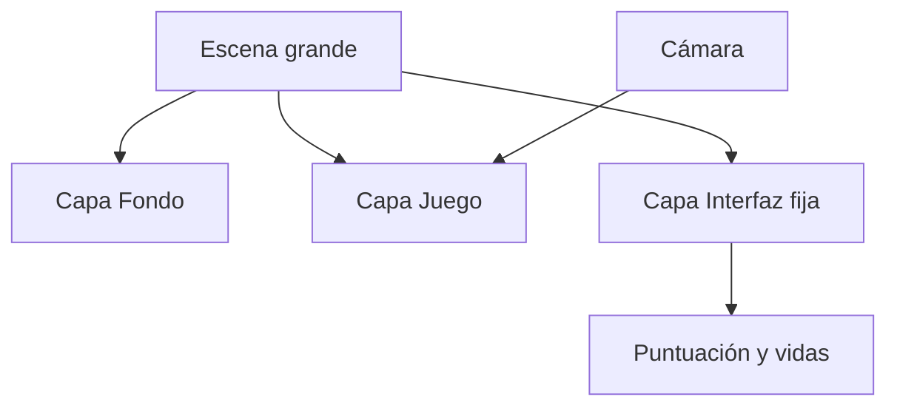

# 4. Movimiento, interfaz y sistemas de juego

## 4.1. Movimiento y entrada

La entrada del jugador puede proceder del teclado, ratón, pantalla táctil, mando o controles virtuales. Separa la entrada de la consecuencia: primero detecta qué quiere hacer la persona y después mueve, anima o cambia el estado del personaje.

Ejemplos:

- izquierda: mantener pulsada una tecla o botón;
- salto: comprobar una pulsación y si el personaje está en el suelo;
- interacción: comprobar proximidad y una tecla de acción;
- móvil: usar botones en una capa de interfaz.

Cuando sea posible, permite reasignar controles y no dependas únicamente del color para comunicar información.

### Paso a paso: controlar a Luna

Si utilizas un comportamiento de movimiento, empieza por probar sus controles predeterminados. Si quieres crear una regla propia:

1. Añade un evento sin condiciones para preparar estados, pero no pongas dentro una suma que deba ocurrir una sola vez.
2. Añade una condición que compruebe si se mantiene pulsada la tecla izquierda.
3. Añade una acción para mover Luna hacia la izquierda o aplicar la velocidad correspondiente.
4. Repite el proceso para derecha, arriba y abajo si el juego es de vista superior.
5. Crea un evento separado para cambiar la animación a `Caminar`.
6. Añade una condición contraria para volver a `Quieta` cuando no se pulse ningún movimiento.

**Resultado esperado:** Luna se mueve de manera predecible y su animación refleja el estado actual.

## 4.2. Cámara y capas

Una cámara determina qué parte de una escena se muestra. En niveles grandes, una cámara puede seguir a Luna. La interfaz suele estar en una capa independiente para que el marcador no se desplace con el mundo.

### Paso a paso: separar mundo e interfaz

1. Abre las capas de la escena y conserva una capa llamada `Base` o `Fondo`.
2. Crea una capa llamada `Juego` para Luna, Guardianes y cristales.
3. Crea una capa llamada `Interfaz`.
4. Añade el texto de puntuación en `Interfaz`.
5. Haz que la cámara siga a Luna solo en `Juego`.
6. Mueve la cámara en la vista previa y observa que el marcador permanece fijo.

Si el marcador se mueve con el escenario, probablemente está en la capa equivocada.

## 4.3. Colisiones y física

Una colisión comprueba si dos objetos ocupan una zona que se considera en contacto. La precisión depende de las máscaras de colisión y de la forma del objeto.

La física puede simular gravedad, velocidad, fuerzas y rebotes. Úsala cuando el movimiento requiera una respuesta física; para un menú o un personaje sencillo puede ser más claro usar un comportamiento especializado.

### Colisión no significa siempre daño

La misma condición de contacto puede producir resultados diferentes:

- Luna toca un cristal: recogerlo.
- Luna toca un Guardian: perder una vida.
- Luna toca una puerta: cambiar de escena.
- Un proyectil toca una pared: destruir el proyectil.

Primero decide qué significa el contacto en tu diseño y después elige las acciones. La herramienta detecta la colisión; tú decides su significado.

## 4.4. Texto e interfaz

La interfaz informa sin distraer. Coloca el marcador en una capa fija, usa un tamaño legible y prueba la escena con distintas resoluciones.

Elementos posibles:

- puntuación;
- vidas;
- barra de energía;
- instrucciones breves;
- botones de pausa;
- mensajes de interacción;
- pantalla de victoria o derrota.

### Paso a paso: crear un marcador

1. Selecciona la capa `Interfaz`.
2. Añade un objeto de texto llamado `TextoCristales`.
3. Colócalo en una esquina con margen suficiente.
4. Escribe inicialmente `Cristales: 0`.
5. En los eventos, actualiza su texto cuando cambie la variable.
6. Prueba una resolución diferente o cambia el tamaño de la ventana.

El texto debe ser legible sin tapar objetos importantes. La interfaz explica el estado del juego; no debe competir con él.

## 4.5. Audio y efectos

Distingue entre música de fondo y efectos. Controla el volumen, evita reproducir el mismo sonido continuamente y ofrece una forma de silenciar el audio.

Una regla de colisión puede reproducir el sonido de recogida. Una transición de escena puede iniciar una música diferente. Los archivos deben tener licencia compatible con el proyecto.

## 4.6. Temporizadores y oleadas

Los temporizadores sirven para controlar acciones que dependen del tiempo: crear enemigos cada tres segundos, mostrar un mensaje durante un segundo o terminar un nivel cuando se agota el tiempo.

No confundas un temporizador con una variable numérica cualquiera: el temporizador expresa una duración y la variable puede guardar un estado o una cantidad.

### Ejemplo: crear Guardianes cada tres segundos

1. Al comenzar la escena, inicia el temporizador `Oleada`.
2. Crea una condición que compruebe si `Oleada` supera 3 segundos.
3. Añade la acción de crear un `Guardian` en una posición elegida.
4. Reinicia el temporizador en la misma acción o evento.
5. Añade un límite si no quieres que aparezcan infinitos enemigos.

Si olvidas reiniciar el temporizador, la condición seguirá siendo verdadera y se crearán Guardianes continuamente en cada actualización.

## 4.7. Guardado local

El almacenamiento local permite conservar preferencias o progresos en el dispositivo. Guarda solo la información necesaria, valida lo que recuperas y evita asumir que todos los dispositivos tienen espacio o que los datos estarán disponibles siempre.

Un ejemplo de diseño:

- al terminar una partida, guardar `MejorPuntuacion`;
- al abrir el menú, leerla;
- si el dato no existe, usar 0;
- mostrarla sin permitir que una entrada inválida rompa el juego.

### Cuándo guardar

Guarda después de un momento importante, como completar un nivel o cambiar una preferencia. No guardes en cada actualización del juego: sería innecesario y puede dificultar detectar errores.

## 4.8. Efectos y partículas

Las partículas son apropiadas para humo, polvo, chispas, magia o lluvia. Los efectos visuales deben reforzar la acción y no impedir leer la escena. Comprueba el rendimiento cuando haya muchas partículas simultáneas.

## 4.9. Escenas, transiciones y datos

Una escena puede cambiar a otra mediante eventos. Antes de cambiar, decide qué datos deben sobrevivir: vidas, puntuación, inventario o configuración. Las variables globales son útiles, pero no conviertas todo en global: mantener el alcance pequeño facilita depurar.

## Actividad: hacer jugable el prototipo

1. Añade una capa `Interfaz`.
2. Crea los textos de cristales y vidas.
3. Añade un sonido al recoger un cristal.
4. Haz que la cámara siga a Luna en un escenario más grande.
5. Crea un temporizador de aparición para los Guardianes.
6. Añade una pantalla de pausa y una opción para reiniciar.
7. Prueba el juego con teclado y, si procede, con controles táctiles.

### Resultado de la actividad

Al terminar, una persona que no conoce el proyecto debería poder:

1. entender qué debe hacer;
2. mover a Luna;
3. recoger un cristal;
4. ver cómo cambia la puntuación;
5. perder o ganar una partida;
6. reiniciar sin cerrar el editor.
