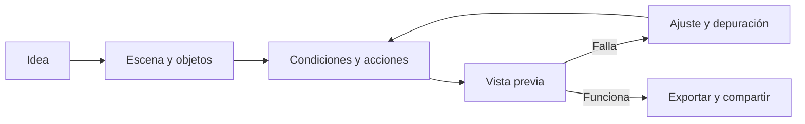

# Tutorial original de GDevelop 5

*Figura 1: Vista general del editor de GDevelop. Imagen enlazada desde la documentación oficial de GDevelop.*

> **Nota:** Este material es un tutorial original en castellano, preparado para aprender GDevelop desde cero. Sigue el mapa de contenidos de la [documentación oficial](https://wiki.gdevelop.io/gdevelop5/), pero no reproduce ni traduce literalmente sus páginas.

## Objetivo

Al terminar, podrás crear un pequeño juego 2D con una escena jugable, un personaje controlable, objetos coleccionables, enemigos, puntuación, interfaz, sonido, guardado y una versión exportada.

## Antes de empezar

Descarga GDevelop desde [gdevelop.io/download](https://gdevelop.io/download) o utiliza su versión web. Los nombres de algunos botones pueden cambiar entre versiones. La idea importante es siempre la misma: **diseñar objetos, describir reglas con eventos y probar cada cambio**.

## Cómo utilizar este tutorial

No intentes leerlo todo de una vez. Trabaja en este orden:

1. Lee la explicación corta del apartado.
2. Sigue los pasos numerados en GDevelop.
3. Detente cuando aparezca **Resultado esperado** y comprueba que coincide.
4. Si funciona, guarda una copia del proyecto.
5. Completa la actividad o la lista de comprobación.

Cada capítulo presupone que has terminado el anterior. Si una opción tiene otro nombre en tu versión, busca una acción equivalente: la interfaz puede cambiar, pero la idea de condición, acción, objeto, instancia y variable se mantiene.

### Convenciones del texto

- `Luna`, `Cristal` y `Bosque` son nombres que debes escribir en GDevelop.
- **Condición** indica una pregunta que el juego debe comprobar.
- **Acción** indica un cambio que el juego debe realizar.
- **Resultado esperado** describe lo que debería ocurrir al probar.
- **Error típico** señala una causa frecuente y dónde buscarla.

### Ruta mínima si tienes poco tiempo

Para construir una primera versión jugable, completa los pasos de los capítulos 1, 2 y 3. Después utiliza el capítulo 4 para añadir interfaz y sonido, el 6 para probar y el 5 cuando necesites reutilizar lógica.

## Índice

<b>Capítulos</b>

- [1. Modelo mental y primer proyecto](01-fundamentos.md)
- [2. Escenas, objetos y recursos](02-escenas-objetos.md)
- [3. Eventos y lógica visual](03-eventos-logica.md)
- [4. Movimiento, interfaz y sistemas de juego](04-recursos-jugabilidad.md)
- [5. Funciones avanzadas y JavaScript](05-funciones-avanzadas.md)
- [6. Pruebas, publicación y trabajo en equipo](06-publicacion.md)

## Proyecto común: *La expedición de Luna*

Durante el tutorial construiremos un prototipo sencillo:

- **Luna** explora un bosque.
- Debe recoger **cristales**.
- Los **guardianes** patrullan el escenario.
- La puntuación aparece en pantalla.
- Al recoger todos los cristales se muestra una pantalla de victoria.

## Referencia rápida

| Necesidad | Concepto de GDevelop |
| :--- | :--- |
| Mostrar un personaje | Objeto Sprite e instancia |
| Crear una pantalla | Escena |
| Decidir qué ocurre | Evento |
| Comprobar una situación | Condición |
| Cambiar el juego | Acción |
| Dar movimiento listo | Comportamiento |
| Guardar un número | Variable |
| Reutilizar lógica | Función o evento externo |
| Organizar elementos | Capas y grupos |
| Revisar un fallo | Vista previa y depurador |

## Glosario inicial

| Palabra | Significado sencillo |
| :--- | :--- |
| Escena | Una pantalla, nivel o momento del juego. |
| Objeto | Un tipo de elemento que se puede reutilizar. |
| Instancia | Una aparición concreta de un objeto en una escena. |
| Evento | Una regla formada por condiciones y acciones. |
| Variable | Un dato que puede cambiar durante la partida. |
| Comportamiento | Una capacidad preparada que se añade a un objeto. |
| Capa | Un nivel visual que organiza lo que se dibuja. |
| Recurso | Una imagen, sonido, fuente, vídeo u otro archivo del proyecto. |
| Vista previa | Ejecución de prueba dentro del flujo de trabajo. |
| Exportar | Preparar una versión para compartir en una plataforma. |

## Documentación oficial

- [Página principal de GDevelop 5](https://wiki.gdevelop.io/gdevelop5/)
- [Primeros pasos](https://wiki.gdevelop.io/gdevelop5/getting_started/)
- [Interfaz](https://wiki.gdevelop.io/gdevelop5/interface/)
- [Objetos](https://wiki.gdevelop.io/gdevelop5/objects/)
- [Comportamientos](https://wiki.gdevelop.io/gdevelop5/behaviors/)
- [Eventos](https://wiki.gdevelop.io/gdevelop5/events/)
- [Funciones avanzadas](https://wiki.gdevelop.io/gdevelop5/all-features/)
- [Publicación](https://wiki.gdevelop.io/gdevelop5/publishing/)

La documentación oficial de GDevelop indica que sus contenidos están publicados, salvo excepciones, bajo [CC BY-SA 4.0](https://creativecommons.org/licenses/by-sa/4.0/). Consulta las condiciones de cada recurso antes de redistribuir imágenes o archivos.
