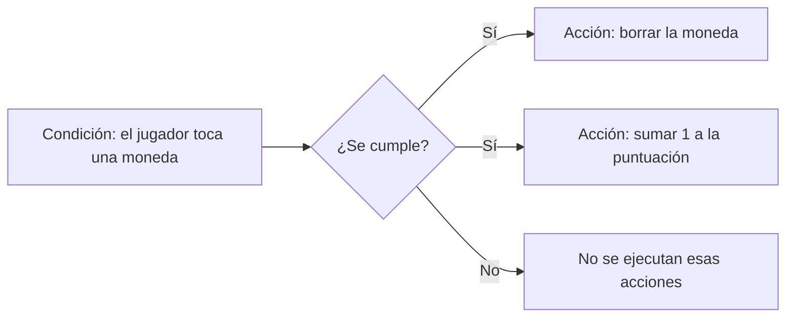

# Tema 2: Introducción a GDevelop

*Figura 1: En un proyecto se alterna entre el gestor, el editor de escenas y el editor de eventos. Imagen: documentación oficial de GDevelop.*

---

## ¿Qué es GDevelop?

**GDevelop** es un motor de creación de videojuegos. Permite diseñar pantallas, añadir personajes y objetos, definir reglas y probar el resultado. Su sistema principal es visual: en lugar de escribir un programa entero, construimos **eventos** con condiciones y acciones. También admite JavaScript para quien quiera ampliar sus posibilidades.

En este tema conocerás las piezas esenciales del programa. No hace falta memorizar todos sus botones: lo importante es comprender cómo se relacionan el proyecto, las escenas, los objetos y los eventos.

## 1. El proyecto y sus zonas de trabajo

Un **proyecto** reúne todo lo que forma el videojuego: escenas, objetos, imágenes, sonidos, eventos y ajustes. Al abvrirlo, GDevelop muestra distintas pestañas y editores.

| Zona | ¿Para qué sirve? |
| :--- | :--- |
| **Gestor del proyecto** | Organiza las escenas, los recursos, las extensiones y otros elementos generales. |
| **Editor de escenas** | Coloca y ordena los elementos que aparecen en una pantalla del juego. |
| **Editor de eventos** | Define las reglas y las respuestas del juego. |
| **Vista previa** | Ejecuta el juego para comprobar cómo funciona. |
| **Depurador** | Ayuda a inspeccionar objetos y valores mientras se ejecuta el juego. |

La barra superior permite cambiar de editor y acceder a herramientas habituales, como deshacer y rehacer, guardar y abrir una vista previa. Los menús superiores ofrecen opciones adicionales de edición, proyecto y ayuda. Su aspecto y algunos nombres pueden cambiar ligeramente según la versión o el idioma instalado.

## 2. Las escenas: las pantallas del juego

Una **escena** es una pantalla o parte del videojuego. Por ejemplo, un juego sencillo puede tener una escena de título, varios niveles y una pantalla final. Cada escena tiene sus propios objetos y puede tener su propia hoja de eventos.

El **editor de escenas** es como un tablero de trabajo. En él se ve el área del juego y se colocan los elementos. La cuadrícula ayuda a alinear objetos; el zoom cambia el tamaño de la vista del editor, no el tamaño final del juego.

*Figura 2: El área central permite organizar visualmente los elementos de una escena. Imagen: documentación oficial de GDevelop.*

En el editor puedes:

1. **Crear o elegir una escena** desde el gestor del proyecto.
2. **Añadir objetos** desde el panel de objetos.
3. **Arrastrar instancias** al área de trabajo y situarlas donde quieras.
4. **Seleccionar y ajustar** cada instancia con sus propiedades.
5. **Abrir la hoja de eventos** para decidir cómo se comportará la escena.

La primera escena del proyecto suele ser el punto de inicio. Si el juego tiene varias pantallas, los eventos permiten pasar de una escena a otra.

## 3. Objetos e instancias

Un **objeto** es una definición reutilizable: indica qué tipo de elemento es y qué características tiene. Una **instancia** es una copia concreta de ese objeto colocada en una escena.

Imagina una moneda: el objeto `Moneda` es el modelo; cada moneda puesta en un nivel es una instancia. Puedes crear muchas instancias del mismo objeto sin configurar cada una desde cero.

Algunos tipos de objeto habituales:

| Tipo de objeto | Uso frecuente |
| :--- | :--- |
| **Sprite** | Personajes, enemigos, decorados y elementos animados. |
| **Texto** | Títulos, instrucciones, diálogos y puntuaciones. |
| **Botón** | Menús e interfaces sencillas. |
| **Audio** | Música y efectos de sonido. |

El objeto se configura desde su editor: por ejemplo, un *Sprite* puede tener una imagen o varias animaciones. Después se añaden sus instancias a la escena.

### Panel de objetos

El panel de objetos muestra los objetos disponibles en la escena. Desde aquí puedes crear uno, abrir su configuración o añadir otra instancia. Pon nombres claros, como `Jugador`, `Suelo` o `Moneda`, para reconocerlos fácilmente al programar los eventos.

*Figura 3: En el panel de objetos se consultan y se añaden los objetos de la escena. Imagen: documentación oficial de GDevelop.*

## 4. Propiedades de una instancia

Al seleccionar una instancia en la escena, aparece el **panel de propiedades**. Allí se pueden modificar características de esa copia concreta, por ejemplo:

- **Posición X e Y:** dónde está en la escena. X aumenta hacia la derecha; Y aumenta hacia abajo.
- **Tamaño:** anchura y altura de la instancia.
- **Ángulo:** cuánto está girada.
- **Capa:** en qué nivel visual se dibuja.
- **Orden Z:** qué objeto aparece delante cuando varios se solapan en una misma capa.
- **Visibilidad:** si se muestra al comenzar la escena.

*Figura 4: Las propiedades permiten ajustar una instancia sin cambiar necesariamente las demás. Imagen: documentación oficial de GDevelop.*

No confundas las propiedades de la **definición del objeto** con las de una **instancia**: cambiar la animación disponible del objeto afecta a su configuración general; mover una instancia solo cambia la posición de esa copia en esa escena.

## 5. Comportamientos: habilidades ya preparadas

Un **comportamiento** (*behavior*) añade una capacidad a un objeto sin tener que construir toda la lógica desde cero. Algunos ejemplos son el movimiento de personaje de plataformas, el movimiento desde arriba, la física o la destrucción de objetos que salen de la pantalla.

Para probar uno, selecciona el objeto y abre su configuración. En el apartado de comportamientos puedes añadirlo y ajustar sus opciones. Por ejemplo, un personaje con comportamiento de plataformas puede caminar y saltar, mientras que el suelo puede configurarse como plataforma. Los eventos pueden completar o modificar ese comportamiento.

## 6. La hoja de eventos: las reglas del juego

El **editor de eventos** es donde se decide qué ocurre durante la partida. Un evento estándar suele tener dos partes:

- **Condiciones:** qué debe cumplirse para que suceda algo.
- **Acciones:** qué hace el juego cuando se cumplen las condiciones.

Se puede leer como una frase: **“Si ocurre esto, entonces haz aquello”**.

Los eventos se procesan de arriba abajo. Si un evento no tiene condiciones, sus acciones se ejecutan continuamente durante la partida; por eso hay que pensar bien cuándo debe repetirse una acción.

### Ejemplo guiado: recoger una moneda

1. Crea los objetos `Jugador` y `Moneda` y coloca sus instancias en la escena.
2. Abre la hoja de eventos de esa escena y añade un evento estándar.
3. En **Añadir condición**, busca una condición de colisión o contacto entre `Jugador` y `Moneda`.
4. En **Añadir acción**, elige borrar o eliminar la instancia de `Moneda` que ha tocado al jugador.
5. Añade otra acción para aumentar en 1 una variable llamada `Puntuacion`.
6. Ejecuta la vista previa, toca la moneda y comprueba que desaparece y que cambia la puntuación.

El nombre exacto de una condición o acción puede variar según el objeto y el idioma de la interfaz. Busca siempre la acción que describa el resultado que necesitas.

### Herramientas para ordenar los eventos

- **Comentarios:** explican una parte de la lógica para que sea más fácil de entender.
- **Grupos:** permiten organizar eventos relacionados.
- **Subeventos:** se ejecutan solo si se cumplen las condiciones del evento que los contiene.
- **Desactivar evento:** permite probar el juego sin borrar una regla.

Al principio, céntrate en eventos estándar y comentarios. Los eventos avanzados se pueden aprender cuando el juego los necesite.

## 7. Variables y recursos

Una **variable** guarda un dato que puede cambiar durante el juego. Por ejemplo, la puntuación, las vidas o el tiempo restante. Puede pertenecer a todo el proyecto, a una escena o a un objeto, según el alcance que necesitemos.

Los **recursos** son archivos que usa el proyecto: imágenes, animaciones, música, efectos de sonido y otros elementos. Mantenerlos ordenados y usar nombres descriptivos ayuda a encontrar cada recurso rápidamente.

## 8. Probar el juego: vista previa y depurador

La **vista previa** inicia el juego para comprobarlo sin exportarlo. Pruébalo a menudo, especialmente después de añadir una regla nueva. Así es más fácil detectar qué cambio ha provocado un resultado inesperado.

El **depurador** permite observar el juego mientras se ejecuta: qué objetos existen, dónde están y qué valores tienen algunas variables. Es útil para investigar preguntas como “¿por qué no aparece la moneda?” o “¿por qué la puntuación no aumenta?”.

Un ciclo de trabajo recomendable es:

1. **Construir:** añadir o modificar una parte pequeña.
2. **Probar:** ejecutar la vista previa.
3. **Observar:** comprobar qué funciona y qué no.
4. **Corregir:** ajustar objetos, propiedades o eventos.
5. **Guardar:** conservar los cambios con frecuencia.

## 9. Los menús y las opciones importantes

No necesitas explorar todos los menús el primer día. Estas zonas serán las más útiles:

| Zona o control | Cuándo utilizarlo |
| :--- | :--- |
| **Gestor del proyecto** | Para elegir escenas y localizar recursos o elementos del proyecto. |
| **Barra superior** | Para guardar, deshacer o rehacer cambios y abrir la vista previa. |
| **Menú de edición** | Para operaciones como copiar, pegar y buscar, según el editor abierto. |
| **Menú de proyecto** | Para consultar ajustes generales y opciones del proyecto. |
| **Menú de ayuda** | Para abrir documentación y recursos de aprendizaje. |
| **Menú junto a Vista previa** | Para acceder a opciones de prueba, como el depurador, si están disponibles. |

Si no encuentras una opción, consulta la documentación o utiliza la búsqueda de comandos de GDevelop si tu versión la incluye. No hace falta cambiar ajustes de publicación para empezar a crear y probar un juego.

## 10. Actividad: mi primera escena interactiva

En parejas o individualmente, crea una escena con un personaje, un suelo y una moneda.

1. Crea un proyecto y ponle un nombre reconocible.
2. Renombra la escena inicial como `Nivel1`.
3. Añade un objeto *Sprite* para el personaje y otro para la moneda. Puedes escoger recursos de ejemplo disponibles en el programa.
4. Coloca las instancias en la escena y modifica su posición y tamaño desde las propiedades.
5. Prueba a realizar ajustes segun lo visto en clase. Experimenta con todos los menus de gdevelop para familiarizarte con el entorno.

### Comprueba lo aprendido

1. ¿Qué diferencia hay entre un objeto y una instancia?
2. ¿En qué editor se colocan los elementos de un nivel?
3. ¿Qué diferencia hay entre una condición y una acción?
4. Si una instancia tiene posición X = 300 e Y = 120, ¿qué representan esos valores?

## Resumen

La lógica esencial de GDevelop se puede recordar así:

> **Proyecto**: reúne el juego. **Escenas**: son sus pantallas. **Objetos**: son los elementos que podemos crear. **Instancias**: son las copias colocadas en una escena. **Propiedades y comportamientos**: ajustan y amplían sus capacidades. **Eventos**: deciden cómo responde el juego. **Vista previa**: permite probarlo.

Para ampliar esta introducción, consulta el [manual oficial de GDevelop](https://wiki.gdevelop.io/gdevelop5/) y, en particular, las páginas sobre [interfaz](https://wiki.gdevelop.io/gdevelop5/interface/), [editor de escenas](https://wiki.gdevelop.io/gdevelop5/interface/scene-editor/), [eventos](https://wiki.gdevelop.io/gdevelop5/events/), [objetos](https://wiki.gdevelop.io/gdevelop5/objects/) y [vista previa](https://wiki.gdevelop.io/gdevelop5/interface/preview/). Las capturas de este documento proceden de la documentación oficial de GDevelop.