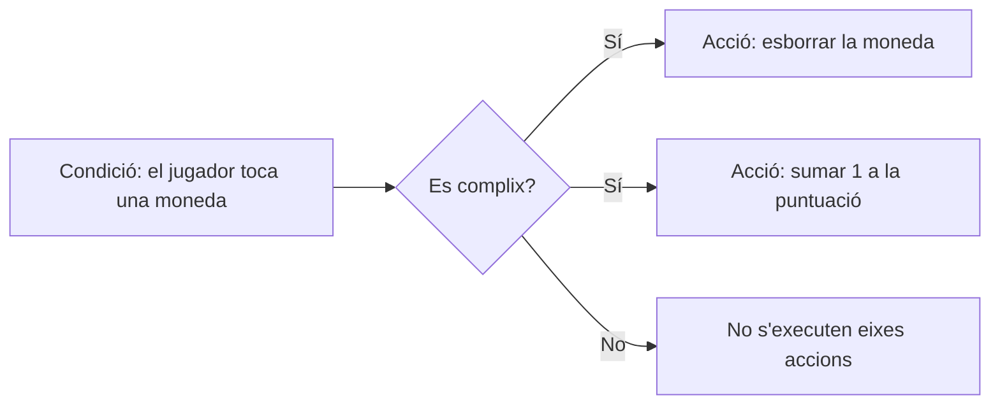

# Tema 2: Introducció a GDevelop

*Figura 1: En un projecte s'alterna entre el gestor, l'editor d'escenes i l'editor d'esdeveniments. Imatge: documentació oficial de GDevelop.*

---

## Què és GDevelop?

**GDevelop** és un motor de creació de videojocs. Permet dissenyar pantalles, afegir personatges i objectes, definir regles i provar el resultat. El seu sistema principal és visual: en compte d'escriure un programa sencer, construïm **esdeveniments** amb condicions i accions. També admet JavaScript per a qui vulga ampliar-ne les possibilitats.

En este tema coneixeràs les peces essencials del programa. No cal memoritzar tots els botons: l'important és comprendre com es relacionen el projecte, les escenes, els objectes i els esdeveniments.

## 1. El projecte i les seues zones de treball

Un **projecte** reunix tot allò que forma el videojoc: escenes, objectes, imatges, sons, esdeveniments i ajustos. En obrir-lo, GDevelop mostra diferents pestanyes i editors.

| Zona | Per a què serveix? |
| :--- | :--- |
| **Gestor del projecte** | Organitza les escenes, els recursos, les extensions i altres elements generals. |
| **Editor d'escenes** | Col·loca i ordena els elements que apareixen en una pantalla del joc. |
| **Editor d'esdeveniments** | Defineix les regles i les respostes del joc. |
| **Vista prèvia** | Executa el joc per a comprovar com funciona. |
| **Depurador** | Ajuda a inspeccionar objectes i valors mentre el joc s'executa. |

La barra superior permet canviar d'editor i accedir a eines habituals, com desfer i refer, guardar i obrir una vista prèvia. Els menús superiors oferixen opcions addicionals d'edició, projecte i ajuda. El seu aspecte i alguns noms poden canviar lleugerament segons la versió o l'idioma instal·lat.

## 2. Les escenes: les pantalles del joc

Una **escena** és una pantalla o una part del videojoc. Per exemple, un joc senzill pot tindre una escena de títol, diversos nivells i una pantalla final. Cada escena té els seus propis objectes i pot tindre el seu propi full d'esdeveniments.

L'**editor d'escenes** és com un tauler de treball. En ell es veu l'àrea del joc i s'hi col·loquen els elements. La quadrícula ajuda a alinear objectes; el zoom canvia la grandària de la vista de l'editor, no la grandària final del joc.

*Figura 2: L'àrea central permet organitzar visualment els elements d'una escena. Imatge: documentació oficial de GDevelop.*

En l'editor pots:

1. **Crear o triar una escena** des del gestor del projecte.
2. **Afegir objectes** des del panell d'objectes.
3. **Arrossegar instàncies** a l'àrea de treball i situar-les on vulgues.
4. **Seleccionar i ajustar** cada instància amb les seues propietats.
5. **Obrir el full d'esdeveniments** per a decidir com es comportarà l'escena.

La primera escena del projecte sol ser el punt d'inici. Si el joc té diverses pantalles, els esdeveniments permeten passar d'una escena a una altra.

## 3. Objectes i instàncies

Un **objecte** és una definició reutilitzable: indica quin tipus d'element és i quines característiques té. Una **instància** és una còpia concreta d'eixe objecte col·locada en una escena.

Imagina una moneda: l'objecte `Moneda` és el model; cada moneda posada en un nivell és una instància. Pots crear moltes instàncies del mateix objecte sense configurar-les una per una des de zero.

Alguns tipus d'objecte habituals:

| Tipus d'objecte | Ús freqüent |
| :--- | :--- |
| **Sprite** | Personatges, enemics, decorats i elements animats. |
| **Text** | Títols, instruccions, diàlegs i puntuacions. |
| **Botó** | Menús i interfícies senzilles. |
| **Àudio** | Música i efectes de so. |

L'objecte es configura des del seu editor: per exemple, un *Sprite* pot tindre una imatge o diverses animacions. Després s'hi afigen les seues instàncies a l'escena.

### Panell d'objectes

El panell d'objectes mostra els objectes disponibles en l'escena. Des d'ací en pots crear un, obrir-ne la configuració o afegir una altra instància. Posa noms clars, com `Jugador`, `Sòl` o `Moneda`, per a reconéixer-los fàcilment quan programes els esdeveniments.

*Figura 3: En el panell d'objectes es consulten i s'afigen els objectes de l'escena. Imatge: documentació oficial de GDevelop.*

## 4. Propietats d'una instància

En seleccionar una instància en l'escena, apareix el **panell de propietats**. Allí es poden modificar característiques d'eixa còpia concreta, per exemple:

- **Posició X i Y:** on està en l'escena. X augmenta cap a la dreta; Y augmenta cap avall.
- **Grandària:** amplària i altura de la instància.
- **Angle:** quant està girada.
- **Capa:** en quin nivell visual es dibuixa.
- **Orde Z:** quin objecte apareix davant quan diversos se superposen en una mateixa capa.
- **Visibilitat:** si es mostra quan comença l'escena.

*Figura 4: Les propietats permeten ajustar una instància sense canviar necessàriament les altres. Imatge: documentació oficial de GDevelop.*

No confundisques les propietats de la **definició de l'objecte** amb les d'una **instància**: canviar l'animació disponible de l'objecte afecta la seua configuració general; moure una instància només canvia la posició d'eixa còpia en eixa escena.

## 5. Comportaments: habilitats ja preparades

Un **comportament** (*behavior*) afig una capacitat a un objecte sense haver de construir tota la lògica des de zero. Alguns exemples són el moviment de personatge de plataformes, el moviment des de dalt, la física o la destrucció d'objectes que ixen de la pantalla.

Per a provar-ne un, selecciona l'objecte i obri'n la configuració. En l'apartat de comportaments pots afegir-lo i ajustar-ne les opcions. Per exemple, un personatge amb comportament de plataformes pot caminar i botar, mentre que el sòl es pot configurar com a plataforma. Els esdeveniments poden completar o modificar eixe comportament.

## 6. El full d'esdeveniments: les regles del joc

L'**editor d'esdeveniments** és on es decidix què passa durant la partida. Un esdeveniment estàndard sol tindre dos parts:

- **Condicions:** què ha de complir-se perquè passe alguna cosa.
- **Accions:** què fa el joc quan es complixen les condicions.

Es pot llegir com una frase: **«Si passa açò, aleshores fes allò»**.

Els esdeveniments es processen de dalt cap avall. Si un esdeveniment no té condicions, les seues accions s'executen contínuament durant la partida; per això cal pensar bé quan s'ha de repetir una acció.

### Exemple guiat: arreplegar una moneda

1. Crea els objectes `Jugador` i `Moneda` i col·loca les seues instàncies en l'escena.
2. Obri el full d'esdeveniments d'eixa escena i afig un esdeveniment estàndard.
3. En **Afig condició**, busca una condició de col·lisió o contacte entre `Jugador` i `Moneda`.
4. En **Afig acció**, tria esborrar o eliminar la instància de `Moneda` que ha tocat el jugador.
5. Afig una altra acció per a augmentar en 1 una variable anomenada `Puntuacio`.
6. Executa la vista prèvia, toca la moneda i comprova que desapareix i que canvia la puntuació.

El nom exacte d'una condició o acció pot variar segons l'objecte i l'idioma de la interfície. Busca sempre l'acció que descriga el resultat que necessites.

### Eines per a ordenar els esdeveniments

- **Comentaris:** expliquen una part de la lògica perquè siga més fàcil d'entendre.
- **Grups:** permeten organitzar esdeveniments relacionats.
- **Subesdeveniments:** s'executen només si es complixen les condicions de l'esdeveniment que els conté.
- **Desactivar esdeveniment:** permet provar el joc sense esborrar una regla.

Al principi, centra't en esdeveniments estàndard i comentaris. Els esdeveniments avançats es poden aprendre quan el joc els necessite.

## 7. Variables i recursos

Una **variable** guarda una dada que pot canviar durant el joc. Per exemple, la puntuació, les vides o el temps que queda. Pot pertànyer a tot el projecte, a una escena o a un objecte, segons l'abast que necessitem.

Els **recursos** són fitxers que usa el projecte: imatges, animacions, música, efectes de so i altres elements. Mantindre'ls ordenats i usar noms descriptius ajuda a trobar cada recurs ràpidament.

## 8. Provar el joc: vista prèvia i depurador

La **vista prèvia** inicia el joc per a comprovar-lo sense exportar-lo. Prova'l sovint, especialment després d'afegir una regla nova. Així és més fàcil detectar quin canvi ha provocat un resultat inesperat.

El **depurador** permet observar el joc mentre s'executa: quins objectes existixen, on estan i quins valors tenen algunes variables. És útil per a investigar preguntes com «per què no apareix la moneda?» o «per què no augmenta la puntuació?».

Un cicle de treball recomanable és:

1. **Construir:** afegir o modificar una part xicoteta.
2. **Provar:** executar la vista prèvia.
3. **Observar:** comprovar què funciona i què no.
4. **Corregir:** ajustar objectes, propietats o esdeveniments.
5. **Guardar:** conservar els canvis sovint.

## 9. Els menús i les opcions importants

No necessites explorar tots els menús el primer dia. Estes zones seran les més útils:

| Zona o control | Quan utilitzar-lo |
| :--- | :--- |
| **Gestor del projecte** | Per a triar escenes i localitzar recursos o elements del projecte. |
| **Barra superior** | Per a guardar, desfer o refer canvis i obrir la vista prèvia. |
| **Menú d'edició** | Per a operacions com copiar, apegar i buscar, segons l'editor obert. |
| **Menú de projecte** | Per a consultar ajustos generals i opcions del projecte. |
| **Menú d'ajuda** | Per a obrir documentació i recursos d'aprenentatge. |
| **Menú al costat de Vista prèvia** | Per a accedir a opcions de prova, com el depurador, si estan disponibles. |

Si no trobes una opció, consulta la documentació o utilitza la busca de comandaments de GDevelop si la teua versió la inclou. No cal canviar els ajustos de publicació per a començar a crear i provar un joc.

## 10. Activitat: la meua primera escena interactiva

En parelles o individualment, crea una escena amb un personatge, un sòl i una moneda.

1. Crea un projecte i posa-li un nom fàcil de reconéixer.
2. Canvia el nom de l'escena inicial a `Nivell1`.
3. Afig un objecte *Sprite* per al personatge i un altre per a la moneda. Pots triar recursos d'exemple disponibles en el programa.
4. Col·loca les instàncies en l'escena i modifica'n la posició i la grandària des de les propietats.
5. Prova de fer ajustos segons el que has vist en classe. Experimenta amb tots els menús de GDevelop per a familiaritzar-te amb l'entorn.

### Comprova el que has aprés

1. Quina diferència hi ha entre un objecte i una instància?
2. En quin editor es col·loquen els elements d'un nivell?
3. Quina diferència hi ha entre una condició i una acció?
4. Si una instància té posició X = 300 i Y = 120, què representen eixos valors?

## Resum

La lògica essencial de GDevelop es pot recordar així:

> **Projecte**: reunix el joc. **Escenes**: són les seues pantalles. **Objectes**: són els elements que podem crear. **Instàncies**: són les còpies col·locades en una escena. **Propietats i comportaments**: ajusten i amplien les seues capacitats. **Esdeveniments**: decidixen com respon el joc. **Vista prèvia**: permet provar-lo.

Per a ampliar esta introducció, consulta el [manual oficial de GDevelop](https://wiki.gdevelop.io/gdevelop5/) i, en particular, les pàgines sobre [interfície](https://wiki.gdevelop.io/gdevelop5/interface/), [editor d'escenes](https://wiki.gdevelop.io/gdevelop5/interface/scene-editor/), [esdeveniments](https://wiki.gdevelop.io/gdevelop5/events/), [objectes](https://wiki.gdevelop.io/gdevelop5/objects/) i [vista prèvia](https://wiki.gdevelop.io/gdevelop5/interface/preview/). Les captures d'este document provenen de la documentació oficial de GDevelop.